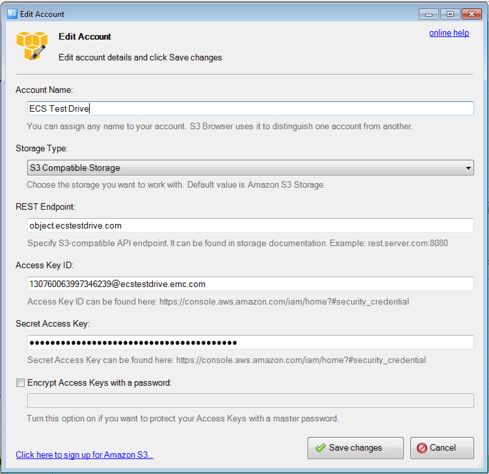
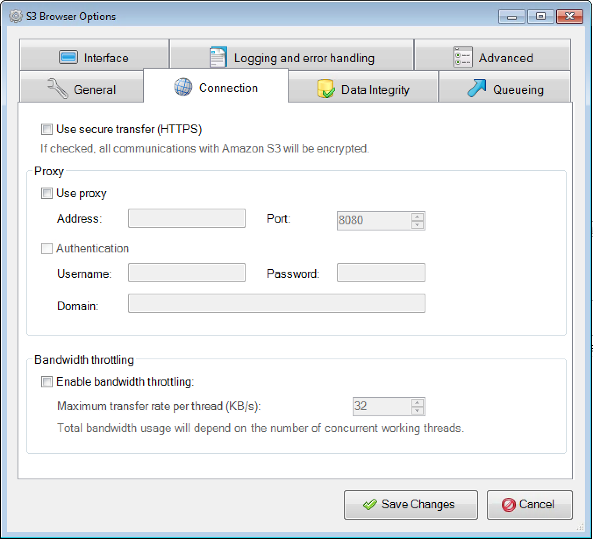
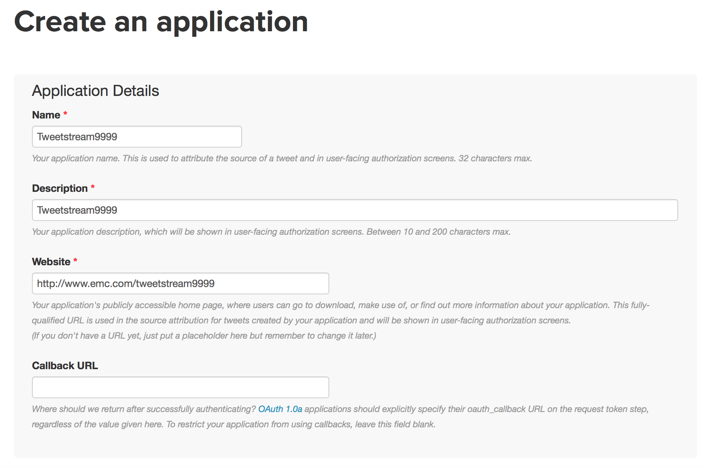
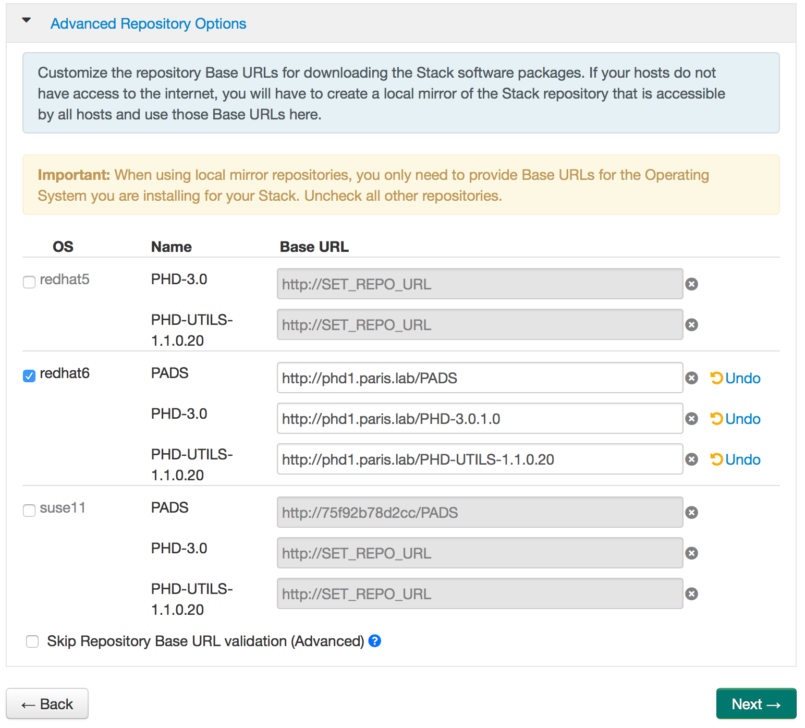
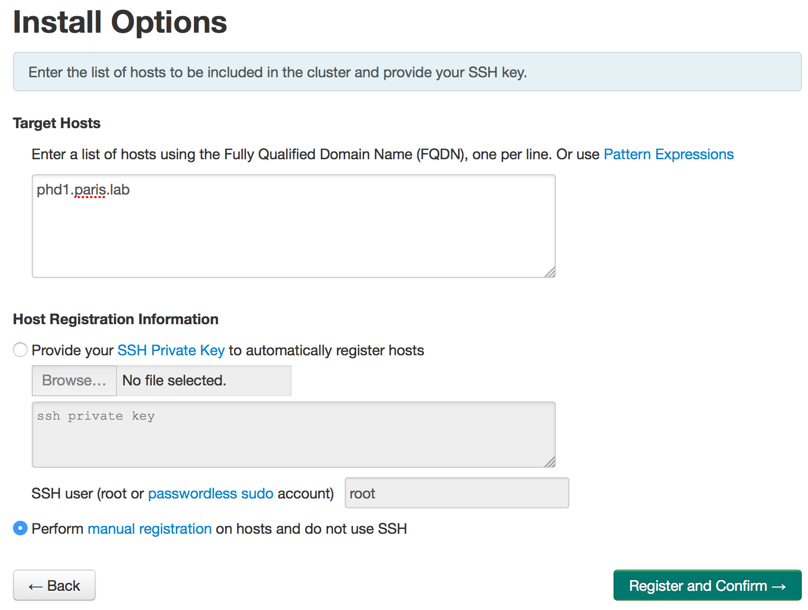
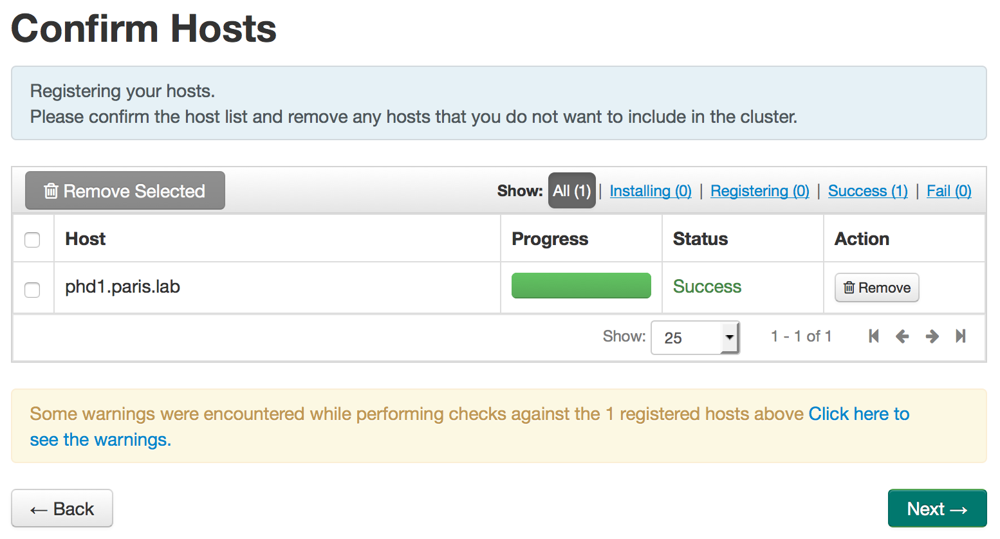
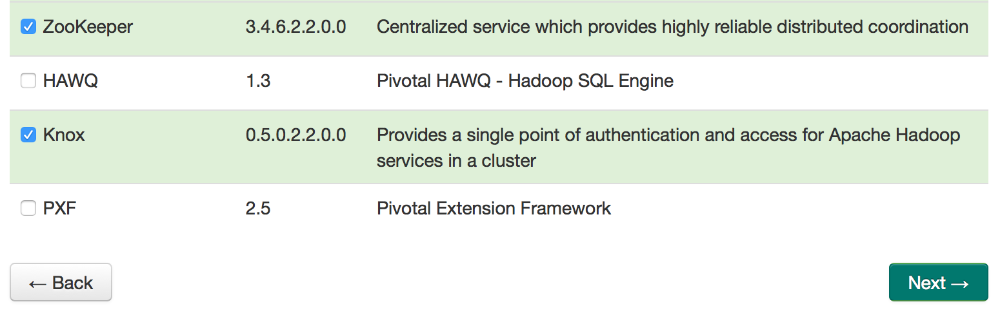
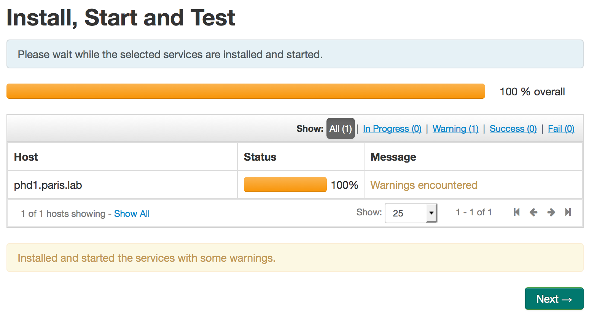
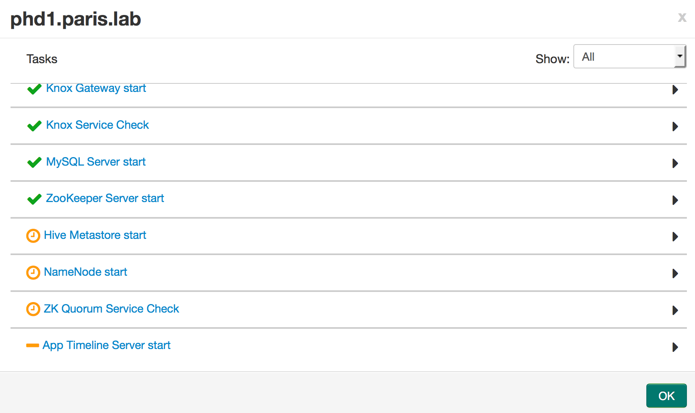
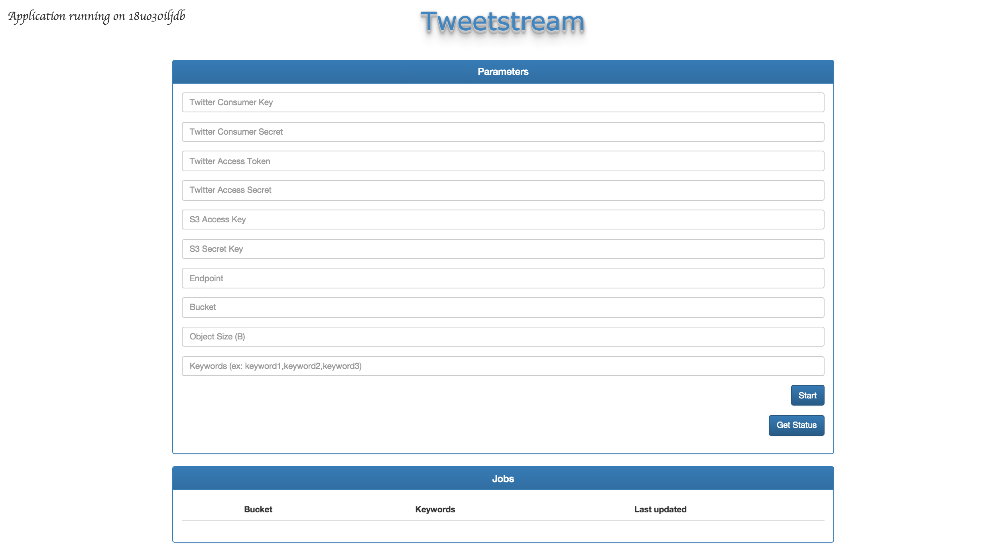

# How to leverage Pivotal Cloud Foundry, Pivotal HD, Apache Spark and EMC ECS to analyze Twitter data

## Prerequisites

The minimum requirement is a Linux Virtual Machine with 16 GB of RAM (24 GB recommended) and Docker installed.

If you're **not** in the EMC network, then you'll also need another Virtual Machine with 32 GB of RAM to run the FREE version of ECS and the Tweetstream application.

### Register on ECS Test Drive

I'll use *ECS Test Drive*  to store data using the Amazon S3 API and I'll then analyze the data through HFDS. Even if *ECS Test Drive* is accessible from both the EMC network and the internet, the HDFS access method is only allowed from the EMC network. If you're not in the EMC network, then you can use the FREE version of ECS available [here](http://www.emc.com/getecs).

First of all, you need to register on [ECS Test Drive](http://portal.ecstestdrive.com).


Your account should be activated less than 24 hours later.

As soon as your account is activated, you need to log in and to click on *Credentials* to generate a *Secret Key*.

Make a note of the *Access Key* and *Secret Key*.

### Create an Amazon S3 bucket on ECS Test Drive

You need to obtain a modified version of s3curl that works with ECS custom metadata.

```
git clone https://github.com/djannot/s3curl.git
```

The *ECS Test Drive* endpoint (*https://object.ecstestdrive.com*) is included in the *s3curl.pl* script.

If you're using the FREE version of ECS instead of *ECS Test Drive*, then you also need to edit the *s3curl.pl* script and replace *https://object.ecstestdrive.com* by *http://\<ECS node IP address\>:9020*.

Then, you need to create a *.s3curl* file in the *s3curl* directory with your *ECS Test Drive* credentials as shown below:

```
%awsSecretAccessKeys = (
  ecstestdrive => {
    id => '<Your Access Key>',
    key => '<Your Secret Key>',
  },
);
```

Finally, you create an Amazon S3 Bucket on *ECS Test Drive* using the following command line:

```
perl s3curl.pl --id ecstestdrive --createBucket --debug -- https://object.ecstestdrive.com/<your Bucket name> -H 'x-emc-file-system-access-enabled: true' -H 'x-amz-grant-full-control: uri="http://acs.amazonaws.com/groups/global/AllUsers"'
```

If you're using the FREE version of ECS instead of *ECS Test Drive*, then you need to replace *https://object.ecstestdrive.com* by *http://\<ECS node IP address\>:9020*.

The *x-emc-file-system-access-enabled: true* header tells ECS to create an Amazon S3 Bucket which will be accessible through HDFS (ViPRFS).

The *x-amz-grant-full-control: uri="http://acs.amazonaws.com/groups/global/AllUsers"* header tells ECS to grant Full Control to everyone. This is mandatory when using ECS HDFS without Kerberos authentication.

### Configure S3Browser to browse your bucket (optional)

Download S3Browser [here](http://s3browser.com) and install it.

S3Browser is a Windows software, so if you're a Mac user (like me) and you don't have access to a Windows desktop or server, you can use Cyberduck instead of S3Browser. But S3Browser is more powerful.

Configure a new account:



If you're using the FREE version of ECS instead of *ECS Test Drive*, then you need to replace *object.ecstestdrive.com* by *\<ECS node IP address\>:9020* and also to disable secure transfer (HTTPS) as shown below:



### Get your Twitter credentials

Go to <https://apps.twitter.com>.

Click on *Create New App*.



You need to indicate a unique name and a website as shown in the picture.

In the *Key and Access Tokens* tab, click on the *Create my access token* button.

Make a note of the *Consumer Key (API Key)*, *Consumer Secret (API Secret)*, *Access Token* and *Access Token Secret*.

## Use the Tweetstream application to gather data from the Twitter streaming API and store them in ECS

Tweetstream is an application I've written in Golang that listen to the Twitter stream, track keywords and write the raw JSON on ECS.

### If you're in the EMC network

This application is running on the EMC Cloud Foundry at <http://tweetstream.cf.isus.emc.com>.

### If you're not in the EMC network

Don't worry, you can run it anywhere :-)

Clone the Github repository using the following command:

```
git clone https://github.com/djannot/tweetstream.git
```

Make sure you have Golang installed and run the following command from the tweetstream directory to compile the application:

```
go build
```

Create another bucket using *s3curl* (You don't need to specify *-H 'x-emc-file-system-access-enabled: true'* as it won't be accessed through HDFS). This bucket won't be used to store data, but only to store information about the jobs you'll run.

Set the environment variables as shown below:

```
export S3_ENDPOINT=http://<ECS node IP address>:9020
export S3_BUCKET=<the new bucket you've just created>
export S3_ACCESS_KEY=<Your Access Key>
export S3_SECRET_KEY=<Your Secret Key>
```

Finally, run the application using the following command line:

```
./tweetstream
```

## Deploy Pivotal HD 3.0

I've created a Docker container to allow you to easily deploy a Pivotal HD 3.0 Hadoop single node cluster.

You can start it using the following command:

```
docker run -t -i -p 18080:8080 --privileged --hostname=phd1.paris.lab djannot/phd3.0 bash
```

I'm using port 18080 because port 8080 is already used on this Linux server.

As soon as the Docker container is started, you need to run the following commands inside the container:

```
[root@phd1 /]# service httpd start
Starting httpd:                                            [  OK  ]
[root@phd1 /]# ambari-server setup -s
Using python  /usr/bin/python2.6
Setup ambari-server
Checking SELinux...
SELinux status is 'disabled'
Customize user account for ambari-server daemon [y/n] (n)? 
Adjusting ambari-server permissions and ownership...
Checking firewall...
WARNING: iptables is running. Confirm the necessary Ambari ports are accessible. Refer to the Ambari documentation for more details on ports.
OK to continue [y/n] (y)? 
Checking JDK...
[1] - Oracle JDK 1.7 + Java Cryptography Extension (JCE) Policy Files 7
[2] - Custom JDK
==============================================================================
Enter choice (1):
JDK already exists, using /var/lib/ambari-server/resources/jdk-7u67-linux-x64.tar.gz
Installing JDK to /usr/jdk64
Successfully installed JDK to /usr/jdk64/jdk1.7.0_67
JCE Policy archive already exists, using /var/lib/ambari-server/resources/UnlimitedJCEPolicyJDK7.zip
Completing setup...
Configuring database...
Enter advanced database configuration [y/n] (n)? 
Default properties detected. Using built-in database.
Checking PostgreSQL...
Running initdb: This may take upto a minute.
Initializing database: [  OK  ]

About to start PostgreSQL
Configuring local database...
Connecting to local database...done.
Configuring PostgreSQL...
Restarting PostgreSQL
Extracting system views...
ambari-admin-1.7.1.88.jar
..
Adjusting ambari-server permissions and ownership...
Ambari Server 'setup' completed successfully.
[root@phd1 /]# ambari-server start
Using python  /usr/bin/python2.6
Starting ambari-server
Ambari Server running with 'root' privileges.
Organizing resource files at /var/lib/ambari-server/resources...
Server PID at: /var/run/ambari-server/ambari-server.pid
Server out at: /var/log/ambari-server/ambari-server.out
Server log at: /var/log/ambari-server/ambari-server.log
Waiting for server start....................
Ambari Server 'start' completed successfully.
[root@phd1 /]# ambari-agent start
Verifying Python version compatibility...
Using python  /usr/bin/python2.6
Checking for previously running Ambari Agent...
Starting ambari-agent
Verifying ambari-agent process status...
Ambari Agent successfully started
Agent PID at: /var/run/ambari-agent/ambari-agent.pid
Agent out at: /var/log/ambari-agent/ambari-agent.out
Agent log at: /var/log/ambari-agent/ambari-agent.log
```

Accept the default options when executing the *ambari-server setup -s* command.

Go to http://<IP of your Linux host>:18080 to access the Ambari log in page.

User and password are *admin*.

Click on *Advanced Repository Options*

Leave only *redhat6* checked and use the following information for the different repositories:

- http://phd1.paris.lab/PADS
- http://phd1.paris.lab/PHD-3.0.1.0
- http://phd1.paris.lab/PHD-UTILS-1.1.0.20



Click on *Next*

Indicate *phd1.paris.lab* in the *Target Hosts* field and select *Perform manual registration on hosts and do not use SSH*.



Click on *Register and Confirm*



Click on *Next*

Unselect *HAWQ* and *PXF*



Click on *Next* several times until you arrive on the *Custumize Services* page.

You need to change the following values on the following tabs:

- HDFS

NameNode directories: /data/hadoop/hdfs/namenode

SecondaryNameNode Checkpoint directories: /data/hadoop/hdfs/namesecondary

DataNode directories: /data/hadoop/hdfs/data

- YARN

yarn.nodemanager.log-dirs: /data/hadoop/yarn/log

yarn.nodemanager.local-dirs: /data/hadoop/yarn/local

yarn.timeline-service.leveldb-timeline-store.path: /data/hadoop/yarn/timeline

- Nagios

Nagios Admin password: password
Hadoop Admin email: denis.jannot@emc.com

- Hive

Database Password: password

- Hbase

HBase local directory (in Advanced hbase-site): /data/hadoop/hbase

- Oozie

Database Password: password

Oozie Data Dir: /data/hadoop/oozie/data

- ZooKeeper

ZooKeeper directory: /data/hadoop/zookeeper

- Knox

Knox Master Secret: password

Click on *Next*

Click on *Deploy*



I always encounter an issue during the install.



The *Hive Metastore* service doesn't start.

You need to run the following commands to fix the issue:

```
[root@phd1 /]# ps -ef | grep mysql | grep -v jdk | awk '{ print $2 }' | while read pid; do kill -9 $pid; done
bash: kill: (22214) - No such process
[root@phd1 /]# /etc/init.d/mysqld start
Starting mysqld:                                           [  OK  ]
[root@phd1 /]# export HIVE_CONF_DIR=/etc/hive/conf.server ; /usr/phd/current/hive-client/bin/schematool -initSchema -dbType mysql -userName hive -passWord password
15/09/19 15:01:11 WARN conf.HiveConf: HiveConf of name hive.optimize.mapjoin.mapreduce does not exist
15/09/19 15:01:11 WARN conf.HiveConf: HiveConf of name hive.heapsize does not exist
15/09/19 15:01:11 WARN conf.HiveConf: HiveConf of name hive.server2.enable.impersonation does not exist
15/09/19 15:01:11 WARN conf.HiveConf: HiveConf of name hive.auto.convert.sortmerge.join.noconditionaltask does not exist
Metastore connection URL:	 jdbc:mysql://phd1.paris.lab/hive?createDatabaseIfNotExist=true
Metastore Connection Driver :	 com.mysql.jdbc.Driver
Metastore connection User:	 hive
Starting metastore schema initialization to 0.14.0
Initialization script hive-schema-0.14.0.mysql.sql
Initialization script completed
schemaTool completed
[root@phd1 /]# /etc/init.d/ambari-agent restart
Verifying Python version compatibility...
Using python  /usr/bin/python2.6
Found ambari-agent PID: 613
Stopping ambari-agent
Removing PID file at /var/run/ambari-agent/ambari-agent.pid
ambari-agent successfully stopped
Verifying Python version compatibility...
Using python  /usr/bin/python2.6
Checking for previously running Ambari Agent...
Starting ambari-agent
Verifying ambari-agent process status...
Ambari Agent successfully started
Agent PID at: /var/run/ambari-agent/ambari-agent.pid
Agent out at: /var/log/ambari-agent/ambari-agent.out
Agent log at: /var/log/ambari-agent/ambari-agent.log
```

Click on *Next*

Click on *Complete*

As soon as the dashboard is displayed, click on *Action* -> *Start All*

Download the ViPRFS client package and run the following commands to copy the jar file in the correct directory:

```
unzip hdfsclient-2.0.1.0.62267.db4d4a8.zip
cp viprfs-client-2.0.1.0.62267.db4d4a8/client/viprfs-client-2.0.1.0-hadoop-2.3.jar /usr/phd/3.0.1.0-1/hadoop/lib/
```

Delete the */staging* directory to free some space:

```
rm -rf /staging
```

Click on the *HDFS* service and then on the *Configs* tab.

Under *Custom core-site*, add the following properties:

- fs.viprfs.impl: com.emc.hadoop.fs.vipr.ViPRFileSystem
- fs.AbstractFileSystem.viprfs.impl: com.emc.hadoop.fs.vipr.ViPRAbstractFileSystem
- fs.vipr.installations: Site1
- fs.vipr.installation.Site1.hosts: 12.7.200.50
- fs.vipr.installation.Site1.hosts.resolution: dynamic
- fs.vipr.installation.Site1.resolution.dynamic: 900000
- fs.permissions.umask-mode: 022
- fs.viprfs.auth.anonymous_translation: CURRENT_USER
- fs.viprfs.auth.identity_translation: NONE

Click on the *MapReduce2* service and then on the *Configs* tab.

Under *Advanced mapred-site*, add */usr/phd/3.0.1.0-1/hadoop/lib/viprfs-client-2.0.1.0-hadoop-2.3.jar* in the *mapreduce.application.classpath* field.

Click on the *Hive* service and then on the *Configs* tab.

Under *Advanced mapred-site*, modify the following properties:

- hive.exec.scratchdir: viprfs://denishdfs2.130760063997346239.Site1/tmp/hive
- hive.metastore.warehouse.dir: viprfs://denishdfs2.130760063997346239.Site1/user/hive/warehouse

Click on the *HDFS* service, click on *Restart* and select *Restart All*.

Run the following commands:

```
mysql -u root -p
Enter password: 
Welcome to the MySQL monitor.  Commands end with ; or \g.
Your MySQL connection id is 194
Server version: 5.1.73 Source distribution

Copyright (c) 2000, 2013, Oracle and/or its affiliates. All rights reserved.

Oracle is a registered trademark of Oracle Corporation and/or its
affiliates. Other names may be trademarks of their respective
owners.

Type 'help;' or '\h' for help. Type '\c' to clear the current input statement.

mysql> use hive;
Reading table information for completion of table and column names
You can turn off this feature to get a quicker startup with -A

Database changed
mysql> select * from DBS;
+-------+-----------------------+------------------------------------------------+---------+------------+------------+
| DB_ID | DESC                  | DB_LOCATION_URI                                | NAME    | OWNER_NAME | OWNER_TYPE |
+-------+-----------------------+------------------------------------------------+---------+------------+------------+
|     1 | Default Hive database | hdfs://phd1.paris.lab:8020/apps/hive/warehouse | default | public     | ROLE       |
+-------+-----------------------+------------------------------------------------+---------+------------+------------+
1 row in set (0.00 sec)

mysql> update DBS set DB_LOCATION_URI='viprfs://denishdfs2.130760063997346239.Site1/user/hive/warehouse' where NAME='default';
Query OK, 1 row affected (0.00 sec)
Rows matched: 1  Changed: 1  Warnings: 0
```

Hit the return key when asked for the password.

Run the following command as *hdfs*:

```
export HDFS_USER=hdfs
export HIVE_USER=hive
hadoop fs -mkdir -p viprfs://denishdfs2.130760063997346239.Site1/user/$HIVE_USER
hadoop fs -chown $HIVE_USER:$HDFS_USER viprfs://denishdfs2.130760063997346239.Site1/user/$HIVE_USER
hadoop fs -mkdir -p viprfs://denishdfs2.130760063997346239.Site1/apps/hive/warehouse
hadoop fs -chown -R $HIVE_USER:$HDFS_USER viprfs://denishdfs2.130760063997346239.Site1/apps/hive
hadoop fs -chmod -R 775 viprfs://denishdfs2.130760063997346239.Site1/apps/hive
hadoop fs -mkdir -p viprfs://denishdfs2.130760063997346239.Site1/tmp/scratch
hadoop fs -chown -R $HIVE_USER:$HDFS_USER viprfs://denishdfs2.130760063997346239.Site1/tmp/scratch
hadoop fs -chmod -R 777 viprfs://denishdfs2.130760063997346239.Site1/tmp/scratch 
hadoop fs -mkdir -p viprfs://denishdfs2.130760063997346239.Site1/tmp/hive
hadoop fs -chown -R $HIVE_USER:$HDFS_USER viprfs://denishdfs2.130760063997346239.Site1/tmp/hive
hadoop fs -chmod -R 777 viprfs://denishdfs2.130760063997346239.Site1/tmp/hive
hadoop fs -mkdir -p viprfs://denishdfs2.130760063997346239.Site1/twitter
hadoop fs -chown -R $HIVE_USER:$HDFS_USER viprfs://denishdfs2.130760063997346239.Site1/twitter
hadoop fs -chmod -R 777 viprfs://denishdfs2.130760063997346239.Site1/twitter
```

On Ambari, click on *Hosts*, then click on *phd1.paris.lab* and finally click on the *Restart* button to apply all the configuration changes.

## Start a job on the Tweetstream application

You can now access the Tweetstream application at <http://tweetstream.cf.isus.emc.com> or <http://localhost> if you've installed it on your laptop.



Use the Twitter credentials you noted before to fill the first 4 fields.

Use the ECS credentials you noted before to fill the next 2 fields.

The *Endpoint* is either *https://object.ecstestdrive.com* if you're in the EMC network or *http://\<ECS node IP address\>:9020* if you're **not** in the EMC network.

The *Bucket* is the name of the first bucket you created using *s3curl*.

The *Object Size (B)* is the object size you want to create on ECS. I recommend using *15728640* (15 MB).

Finally, indicate one or several keywords. If you have no idea, just use *twitter*. It will generate a new 15 MB object every few minutes wiht this keyword. If you use something to specific, you could have to wait hours before getting enough data to create create a 15 MB object.

You can click on *Get Status* to see when the latest object has been created.

## Run a hive job

Run the following commands to download a script to perform a Twitter sentiment analysis using Apache Hive:

```
yum -y install git
su - hive
git clone https://gist.github.com/2795525.git
```

Go to the *2795525* directory and edit the *positweets.hive* to replace:

```
create table raw_tweets (json string);
load data local inpath 'sample.json' into table raw_tweets;
```

By:

```
set hive.metastore.warehouse.dir=viprfs://denishdfs2.130760063997346239.Site1/user/hive/warehouse;
create external table raw_tweets (json string) location 'viprfs://denishdfs2.130760063997346239.Site1/twitter';
```

Run the script using the following command:

```
[hive@phd1 2795525]$ hive -f positweets.hive 
15/09/19 21:42:34 WARN conf.HiveConf: HiveConf of name hive.optimize.mapjoin.mapreduce does not exist
15/09/19 21:42:34 WARN conf.HiveConf: HiveConf of name hive.heapsize does not exist
15/09/19 21:42:34 WARN conf.HiveConf: HiveConf of name hive.server2.enable.impersonation does not exist
15/09/19 21:42:34 WARN conf.HiveConf: HiveConf of name hive.auto.convert.sortmerge.join.noconditionaltask does not exist

Logging initialized using configuration in file:/etc/hive/conf/hive-log4j.properties
SLF4J: Class path contains multiple SLF4J bindings.
SLF4J: Found binding in [jar:file:/usr/phd/3.0.1.0-1/hadoop/lib/slf4j-log4j12-1.7.5.jar!/org/slf4j/impl/StaticLoggerBinder.class]
SLF4J: Found binding in [jar:file:/usr/phd/3.0.1.0-1/hive/lib/hive-jdbc-0.14.0.3.0.1.0-1-standalone.jar!/org/slf4j/impl/StaticLoggerBinder.class]
SLF4J: See http://www.slf4j.org/codes.html#multiple_bindings for an explanation.
SLF4J: Actual binding is of type [org.slf4j.impl.Log4jLoggerFactory]
OK
Time taken: 26.868 seconds
OK
Time taken: 0.04 seconds
OK
Time taken: 0.088 seconds
OK
Time taken: 0.048 seconds
OK
Time taken: 0.037 seconds
OK
Time taken: 7.865 seconds
Query ID = hive_20150919214343_f8fe30f7-cde5-4ada-beae-8514fea39146
Total jobs = 3
Launching Job 1 out of 3
Number of reduce tasks is set to 0 since there's no reduce operator
Starting Job = job_1442695777245_0001, Tracking URL = http://phd1.paris.lab:8088/proxy/application_1442695777245_0001/
Kill Command = /usr/phd/3.0.1.0-1/hadoop/bin/hadoop job  -kill job_1442695777245_0001
Hadoop job information for Stage-1: number of mappers: 1; number of reducers: 0
2015-09-19 21:47:49,013 Stage-1 map = 0%,  reduce = 0%
2015-09-19 21:48:49,596 Stage-1 map = 0%,  reduce = 0%, Cumulative CPU 8.73 sec
2015-09-19 21:49:15,918 Stage-1 map = 20%,  reduce = 0%, Cumulative CPU 37.58 sec
2015-09-19 21:49:30,612 Stage-1 map = 40%,  reduce = 0%, Cumulative CPU 46.46 sec
2015-09-19 21:49:45,047 Stage-1 map = 60%,  reduce = 0%, Cumulative CPU 55.61 sec
2015-09-19 21:49:53,457 Stage-1 map = 80%,  reduce = 0%, Cumulative CPU 58.93 sec
2015-09-19 21:49:59,785 Stage-1 map = 100%,  reduce = 0%, Cumulative CPU 61.1 sec
MapReduce Total cumulative CPU time: 1 minutes 1 seconds 100 msec
Ended Job = job_1442695777245_0001
Stage-4 is selected by condition resolver.
Stage-3 is filtered out by condition resolver.
Stage-5 is filtered out by condition resolver.
Moving data to: viprfs://denishdfs2.130760063997346239.Site1/tmp/hive/hive/f1f000de-fbcd-4768-9066-54abf166bf6a/hive_2015-09-19_21-43-39_503_1507775810318161803-1/-ext-10001
Moving data to: viprfs://denishdfs2.130760063997346239.Site1/user/hive/warehouse/tweets
Table default.tweets stats: [numFiles=1, numRows=17986, totalSize=1936127, rawDataSize=1918141]
MapReduce Jobs Launched: 
Stage-Stage-1: Map: 1   Cumulative CPU: 61.67 sec   HDFS Read: 687 HDFS Write: 0 SUCCESS
Total MapReduce CPU Time Spent: 1 minutes 1 seconds 670 msec
OK
Time taken: 412.697 seconds
Query ID = hive_20150919215050_9dc00e31-96cc-41a1-b96a-63130f611791
Total jobs = 3
Launching Job 1 out of 3
Number of reduce tasks is set to 0 since there's no reduce operator
Starting Job = job_1442695777245_0002, Tracking URL = http://phd1.paris.lab:8088/proxy/application_1442695777245_0002/
Kill Command = /usr/phd/3.0.1.0-1/hadoop/bin/hadoop job  -kill job_1442695777245_0002
Hadoop job information for Stage-1: number of mappers: 1; number of reducers: 0
2015-09-19 21:52:44,582 Stage-1 map = 0%,  reduce = 0%
2015-09-19 21:53:46,307 Stage-1 map = 0%,  reduce = 0%, Cumulative CPU 20.04 sec
2015-09-19 21:53:49,866 Stage-1 map = 100%,  reduce = 0%, Cumulative CPU 25.58 sec
MapReduce Total cumulative CPU time: 25 seconds 580 msec
Ended Job = job_1442695777245_0002
Stage-4 is selected by condition resolver.
Stage-3 is filtered out by condition resolver.
Stage-5 is filtered out by condition resolver.
Moving data to: viprfs://denishdfs2.130760063997346239.Site1/tmp/hive/hive/f1f000de-fbcd-4768-9066-54abf166bf6a/hive_2015-09-19_21-50-33_564_9108497779987947798-1/-ext-10001
Moving data to: viprfs://denishdfs2.130760063997346239.Site1/user/hive/warehouse/positive_hashtags_per_day
Table default.positive_hashtags_per_day stats: [numFiles=1, numRows=15, totalSize=354, rawDataSize=339]
MapReduce Jobs Launched: 
Stage-Stage-1: Map: 1   Cumulative CPU: 25.58 sec   HDFS Read: 234 HDFS Write: 0 SUCCESS
Total MapReduce CPU Time Spent: 25 seconds 580 msec
OK
Time taken: 216.046 seconds
Query ID = hive_20150919215454_54b623a4-f49b-44e6-bd35-7870e31e16c9
Total jobs = 1
Launching Job 1 out of 1
Number of reduce tasks not specified. Estimated from input data size: 1
In order to change the average load for a reducer (in bytes):
  set hive.exec.reducers.bytes.per.reducer=<number>
In order to limit the maximum number of reducers:
  set hive.exec.reducers.max=<number>
In order to set a constant number of reducers:
  set mapreduce.job.reduces=<number>
Starting Job = job_1442695777245_0003, Tracking URL = http://phd1.paris.lab:8088/proxy/application_1442695777245_0003/
Kill Command = /usr/phd/3.0.1.0-1/hadoop/bin/hadoop job  -kill job_1442695777245_0003
Hadoop job information for Stage-1: number of mappers: 1; number of reducers: 1
2015-09-19 21:55:49,693 Stage-1 map = 0%,  reduce = 0%
2015-09-19 21:56:44,123 Stage-1 map = 100%,  reduce = 0%, Cumulative CPU 20.07 sec
2015-09-19 21:57:31,936 Stage-1 map = 100%,  reduce = 67%, Cumulative CPU 27.07 sec
2015-09-19 21:57:37,886 Stage-1 map = 100%,  reduce = 100%, Cumulative CPU 30.55 sec
MapReduce Total cumulative CPU time: 30 seconds 550 msec
Ended Job = job_1442695777245_0003
Moving data to: viprfs://denishdfs2.130760063997346239.Site1/user/hive/warehouse/count_positive_hashtags_per_day
Table default.count_positive_hashtags_per_day stats: [numFiles=1, numRows=14, totalSize=349, rawDataSize=335]
MapReduce Jobs Launched: 
Stage-Stage-1: Map: 1  Reduce: 1   Cumulative CPU: 30.91 sec   HDFS Read: 253 HDFS Write: 0 SUCCESS
Total MapReduce CPU Time Spent: 30 seconds 910 msec
OK
Time taken: 228.184 seconds
Added resources: [topN.py]
Query ID = hive_20150919215858_ff376a53-46aa-44a2-8dcd-97c835c5276f
Total jobs = 1
Launching Job 1 out of 1
Number of reduce tasks not specified. Estimated from input data size: 1
In order to change the average load for a reducer (in bytes):
  set hive.exec.reducers.bytes.per.reducer=<number>
In order to limit the maximum number of reducers:
  set hive.exec.reducers.max=<number>
In order to set a constant number of reducers:
  set mapreduce.job.reduces=<number>
Starting Job = job_1442695777245_0004, Tracking URL = http://phd1.paris.lab:8088/proxy/application_1442695777245_0004/
Kill Command = /usr/phd/3.0.1.0-1/hadoop/bin/hadoop job  -kill job_1442695777245_0004
Hadoop job information for Stage-1: number of mappers: 1; number of reducers: 1
2015-09-19 21:59:26,094 Stage-1 map = 0%,  reduce = 0%
2015-09-19 22:00:27,794 Stage-1 map = 0%,  reduce = 0%, Cumulative CPU 13.95 sec
2015-09-19 22:00:29,576 Stage-1 map = 100%,  reduce = 0%, Cumulative CPU 16.85 sec
2015-09-19 22:01:19,095 Stage-1 map = 100%,  reduce = 100%, Cumulative CPU 24.67 sec
MapReduce Total cumulative CPU time: 24 seconds 670 msec
Ended Job = job_1442695777245_0004
Moving data to: viprfs://denishdfs2.130760063997346239.Site1/user/hive/warehouse/top5_positive_hashtags_per_day
Table default.top5_positive_hashtags_per_day stats: [numFiles=1, numRows=5, totalSize=111, rawDataSize=106]
MapReduce Jobs Launched: 
Stage-Stage-1: Map: 1  Reduce: 1   Cumulative CPU: 26.44 sec   HDFS Read: 259 HDFS Write: 0 SUCCESS
Total MapReduce CPU Time Spent: 26 seconds 440 msec
OK
Time taken: 223.633 seconds
OK
2015-09-19	#aldubmostawaiteddate	2
2015-09-19	#yoga	1
2015-09-19	#rt	1
2015-09-19	#paluten	1
2015-09-19	#mtg	1
Time taken: 2.287 seconds, Fetched: 5 row(s)
``` 

As you can see, I've been able to easily find the top 5 hashtags per day which are associated with positive sentiment signals (using simple smileys).

You can find more information about the Hive script [here](http://blog.xebia.com/2012/05/15/sentiment-analysis-using-apache-hive/).

This demonstrates the ability of running analytics using Hive on data stored on ECS.

## Download and configure Spark

Run the following commands

```
wget http://d3kbcqa49mib13.cloudfront.net/spark-1.5.0-bin-without-hadoop.tgz
tar zxvf spark-1.5.0-bin-without-hadoop.tgz
cd spark-1.5.0-bin-without-hadoop

```

Create a *conf/core-site.xml* file with the following content:

```
<configuration>
    <property>
      <name>fs.viprfs.impl</name>
      <value>com.emc.hadoop.fs.vipr.ViPRFileSystem</value>
    </property>

    <property>
      <name>fs.AbstractFileSystem.viprfs.impl</name>
      <value>com.emc.hadoop.fs.vipr.ViPRAbstractFileSystem</value>
    </property>

    <property>
      <name>fs.vipr.installations</name>
      <value>Site1</value>
    </property>

    <property>
      <name>fs.vipr.installation.Site1.hosts</name>
      <value>12.7.200.50</value>
    </property>

    <property>
      <name>fs.vipr.installation.Site1.hosts.resolution</name>
      <value>dynamic</value>
    </property>

    <property>
      <name>fs.vipr.installation.Site1.resolution.dynamic</name>
      <value>900000</value>
    </property>

    <property>
      <name>fs.permissions.umask-mode</name>
      <value>022</value>
    </property>

    <property>
      <name>fs.viprfs.auth.anonymous_translation</name>
      <value>CURRENT_USER</value>
    </property>

    <property>
      <name>fs.viprfs.auth.identity_translation</name>
      <value>NONE</value>
    </property>

    <property>
      <name>fs.defaultFS</name>
      <value>viprfs://denishdfs2.130760063997346239.Site1/</value>
    </property>
</configuration>
```

Run the following command:

```
cp conf/spark-env.sh.template conf/spark-env.sh
```

Add the following line to the *conf/spark-env.sh* file: 

```
export HADOOP_HOME=/usr/phd/3.0.1.0-1/hadoop
export SPARK_DIST_CLASSPATH=/usr/phd/3.0.1.0-1/hadoop/conf:/usr/phd/3.0.1.0-1/hadoop/lib/*:/usr/phd/3.0.1.0-1/hadoop/.//*:/usr/phd/3.0.1.0-1/hadoop-hdfs/./:/usr/phd/3.0.1.0-1/hadoop-hdfs/lib/*:/usr/phd/3.0.1.0-1/hadoop-hdfs/.//*:/usr/phd/3.0.1.0-1/hadoop-yarn/lib/*:/usr/phd/3.0.1.0-1/hadoop-yarn/.//*:/usr/phd/3.0.1.0-1/hadoop-mapreduce/lib/*:/usr/phd/3.0.1.0-1/hadoop-mapreduce/.//*::/usr/share/java/mysql-connector-java-5.1.17.jar:/usr/share/java/mysql-connector-java.jar:/usr/phd/current/hadoop-mapreduce-client/*:/usr/phd/current/tez-client/*:/usr/phd/current/tez-client/lib/*:/etc/tez/conf/:/usr/phd/3.0.1.0-1/tez/*:/usr/phd/3.0.1.0-1/tez/lib/*:/etc/tez/conf
export HADOOP_CONF_DIR=/root/spark-1.5.0-bin-without-hadoop/conf
```

Create the *conf/spark-defaults.conf* file with the following content:

```
spark.driver.extraJavaOptions -Dhdp.version=3.0.1.0-1
spark.yarn.am.extraJavaOptions -Dhdp.version=3.0.1.0-1
```

## Run a Spark job

Run the following commands:

```
[root@phd1 spark-1.5.0-bin-without-hadoop]# bin/spark-shell --jars /usr/phd/3.0.1.0-1/hadoop/lib/viprfs-client-2.0.1.0-hadoop-2.3.jar --verbose
Using properties file: /spark-1.5.0-bin-without-hadoop/conf/spark-defaults.conf
Adding default property: spark.driver.extraJavaOptions=-Dhdp.version=3.0.1.0-1
Adding default property: spark.yarn.am.extraJavaOptions=-Dhdp.version=3.0.1.0-1
Parsed arguments:
  master                  local[*]
  deployMode              null
  executorMemory          null
  executorCores           null
  totalExecutorCores      null
  propertiesFile          /spark-1.5.0-bin-without-hadoop/conf/spark-defaults.conf
  driverMemory            null
  driverCores             null
  driverExtraClassPath    null
  driverExtraLibraryPath  null
  driverExtraJavaOptions  -Dhdp.version=3.0.1.0-1
  supervise               false
  queue                   null
  numExecutors            null
  files                   null
  pyFiles                 null
  archives                null
  mainClass               org.apache.spark.repl.Main
  primaryResource         spark-shell
  name                    Spark shell
  childArgs               []
  jars                    file:/usr/phd/3.0.1.0-1/hadoop/lib/viprfs-client-2.0.1.0-hadoop-2.3.jar
  packages                null
  packagesExclusions      null
  repositories            null
  verbose                 true

Spark properties used, including those specified through
 --conf and those from the properties file /spark-1.5.0-bin-without-hadoop/conf/spark-defaults.conf:
  spark.driver.extraJavaOptions -> -Dhdp.version=3.0.1.0-1
  spark.yarn.am.extraJavaOptions -> -Dhdp.version=3.0.1.0-1

    
Main class:
org.apache.spark.repl.Main
Arguments:

System properties:
SPARK_SUBMIT -> true
spark.app.name -> Spark shell
spark.driver.extraJavaOptions -> -Dhdp.version=3.0.1.0-1
spark.yarn.am.extraJavaOptions -> -Dhdp.version=3.0.1.0-1
spark.jars -> file:/usr/phd/3.0.1.0-1/hadoop/lib/viprfs-client-2.0.1.0-hadoop-2.3.jar
spark.submit.deployMode -> client
spark.master -> local[*]
Classpath elements:
file:/usr/phd/3.0.1.0-1/hadoop/lib/viprfs-client-2.0.1.0-hadoop-2.3.jar


15/09/19 22:08:54 WARN util.NativeCodeLoader: Unable to load native-hadoop library for your platform... using builtin-java classes where applicable
15/09/19 22:08:57 INFO spark.SecurityManager: Changing view acls to: root
15/09/19 22:08:57 INFO spark.SecurityManager: Changing modify acls to: root
15/09/19 22:08:57 INFO spark.SecurityManager: SecurityManager: authentication disabled; ui acls disabled; users with view permissions: Set(root); users with modify permissions: Set(root)
15/09/19 22:09:00 INFO spark.HttpServer: Starting HTTP Server
15/09/19 22:09:00 INFO server.Server: jetty-8.y.z-SNAPSHOT
15/09/19 22:09:00 INFO server.AbstractConnector: Started SocketConnector@0.0.0.0:47984
15/09/19 22:09:00 INFO util.Utils: Successfully started service 'HTTP class server' on port 47984.
Welcome to
      ____              __
     / __/__  ___ _____/ /__
    _\ \/ _ \/ _ `/ __/  '_/
   /___/ .__/\_,_/_/ /_/\_\   version 1.5.0
      /_/

Using Scala version 2.10.4 (OpenJDK 64-Bit Server VM, Java 1.8.0_51)
Type in expressions to have them evaluated.
Type :help for more information.
15/09/19 22:11:08 INFO spark.SparkContext: Running Spark version 1.5.0
15/09/19 22:11:09 INFO spark.SecurityManager: Changing view acls to: root
15/09/19 22:11:09 INFO spark.SecurityManager: Changing modify acls to: root
15/09/19 22:11:09 INFO spark.SecurityManager: SecurityManager: authentication disabled; ui acls disabled; users with view permissions: Set(root); users with modify permissions: Set(root)
15/09/19 22:11:14 INFO slf4j.Slf4jLogger: Slf4jLogger started
15/09/19 22:11:15 INFO Remoting: Starting remoting
15/09/19 22:11:19 INFO Remoting: Remoting started; listening on addresses :[akka.tcp://sparkDriver@10.1.56.20:33961]
15/09/19 22:11:19 INFO util.Utils: Successfully started service 'sparkDriver' on port 33961.
15/09/19 22:11:19 INFO spark.SparkEnv: Registering MapOutputTracker
15/09/19 22:11:20 INFO spark.SparkEnv: Registering BlockManagerMaster
15/09/19 22:11:20 INFO storage.DiskBlockManager: Created local directory at /tmp/blockmgr-fa6e0474-5546-484f-ba0e-ebaedfdbf56e
15/09/19 22:11:20 INFO storage.MemoryStore: MemoryStore started with capacity 530.0 MB
15/09/19 22:11:22 INFO spark.HttpFileServer: HTTP File server directory is /tmp/spark-c5722a4a-1b52-4c09-b417-b79f84f2b8e3/httpd-1a08bb60-5399-4e2d-ad3c-3df0d69a507e
15/09/19 22:11:22 INFO spark.HttpServer: Starting HTTP Server
15/09/19 22:11:22 INFO server.Server: jetty-8.y.z-SNAPSHOT
15/09/19 22:11:22 INFO server.AbstractConnector: Started SocketConnector@0.0.0.0:33330
15/09/19 22:11:22 INFO util.Utils: Successfully started service 'HTTP file server' on port 33330.
15/09/19 22:11:22 INFO spark.SparkEnv: Registering OutputCommitCoordinator
15/09/19 22:11:29 INFO server.Server: jetty-8.y.z-SNAPSHOT
15/09/19 22:11:30 INFO server.AbstractConnector: Started SelectChannelConnector@0.0.0.0:4040
15/09/19 22:11:30 INFO util.Utils: Successfully started service 'SparkUI' on port 4040.
15/09/19 22:11:30 INFO ui.SparkUI: Started SparkUI at http://10.1.56.20:4040
15/09/19 22:11:30 INFO spark.SparkContext: Added JAR file:/usr/phd/3.0.1.0-1/hadoop/lib/viprfs-client-2.0.1.0-hadoop-2.3.jar at http://10.1.56.20:33330/jars/viprfs-client-2.0.1.0-hadoop-2.3.jar with timestamp 1442700690860
15/09/19 22:11:32 WARN metrics.MetricsSystem: Using default name DAGScheduler for source because spark.app.id is not set.
15/09/19 22:11:32 INFO executor.Executor: Starting executor ID driver on host localhost
15/09/19 22:11:32 INFO executor.Executor: Using REPL class URI: http://10.1.56.20:47984
15/09/19 22:11:36 INFO util.Utils: Successfully started service 'org.apache.spark.network.netty.NettyBlockTransferService' on port 50050.
15/09/19 22:11:36 INFO netty.NettyBlockTransferService: Server created on 50050
15/09/19 22:11:36 INFO storage.BlockManagerMaster: Trying to register BlockManager
15/09/19 22:11:36 INFO storage.BlockManagerMasterEndpoint: Registering block manager localhost:50050 with 530.0 MB RAM, BlockManagerId(driver, localhost, 50050)
15/09/19 22:11:36 INFO storage.BlockManagerMaster: Registered BlockManager
15/09/19 22:11:38 INFO repl.SparkILoop: Created spark context..
Spark context available as sc.
15/09/19 22:12:22 INFO repl.SparkILoop: Created sql context..
SQL context available as sqlContext.

scala> val sqlContext = new org.apache.spark.sql.SQLContext(sc)
sqlContext: org.apache.spark.sql.SQLContext = org.apache.spark.sql.SQLContext@2559f65c

scala> val path = "/twitter"
path: String = /twitter

scala> val tweets = sqlContext.read.json(path)
15/09/19 22:13:09 INFO json.JSONRelation: Listing viprfs://denishdfs2.130760063997346239.Site1/twitter on driver
15/09/19 22:13:22 INFO storage.MemoryStore: ensureFreeSpace(231352) called with curMem=0, maxMem=555755765
15/09/19 22:13:22 INFO storage.MemoryStore: Block broadcast_0 stored as values in memory (estimated size 225.9 KB, free 529.8 MB)
15/09/19 22:13:27 INFO storage.MemoryStore: ensureFreeSpace(23080) called with curMem=231352, maxMem=555755765
15/09/19 22:13:27 INFO storage.MemoryStore: Block broadcast_0_piece0 stored as bytes in memory (estimated size 22.5 KB, free 529.8 MB)
15/09/19 22:13:28 INFO storage.BlockManagerInfo: Added broadcast_0_piece0 in memory on localhost:50050 (size: 22.5 KB, free: 530.0 MB)
15/09/19 22:13:28 INFO spark.SparkContext: Created broadcast 0 from json at <console>:25
15/09/19 22:13:31 INFO mapred.FileInputFormat: Total input paths to process : 5
15/09/19 22:13:31 INFO spark.SparkContext: Starting job: json at <console>:25
15/09/19 22:13:32 INFO scheduler.DAGScheduler: Got job 0 (json at <console>:25) with 5 output partitions
15/09/19 22:13:32 INFO scheduler.DAGScheduler: Final stage: ResultStage 0(json at <console>:25)
15/09/19 22:13:32 INFO scheduler.DAGScheduler: Parents of final stage: List()
15/09/19 22:13:32 INFO scheduler.DAGScheduler: Missing parents: List()
15/09/19 22:13:32 INFO scheduler.DAGScheduler: Submitting ResultStage 0 (MapPartitionsRDD[3] at json at <console>:25), which has no missing parents
15/09/19 22:13:32 INFO storage.MemoryStore: ensureFreeSpace(4368) called with curMem=254432, maxMem=555755765
15/09/19 22:13:32 INFO storage.MemoryStore: Block broadcast_1 stored as values in memory (estimated size 4.3 KB, free 529.8 MB)
15/09/19 22:13:32 INFO storage.MemoryStore: ensureFreeSpace(2458) called with curMem=258800, maxMem=555755765
15/09/19 22:13:32 INFO storage.MemoryStore: Block broadcast_1_piece0 stored as bytes in memory (estimated size 2.4 KB, free 529.8 MB)
15/09/19 22:13:32 INFO storage.BlockManagerInfo: Added broadcast_1_piece0 in memory on localhost:50050 (size: 2.4 KB, free: 530.0 MB)
15/09/19 22:13:32 INFO spark.SparkContext: Created broadcast 1 from broadcast at DAGScheduler.scala:861
15/09/19 22:13:32 INFO scheduler.DAGScheduler: Submitting 5 missing tasks from ResultStage 0 (MapPartitionsRDD[3] at json at <console>:25)
15/09/19 22:13:32 INFO scheduler.TaskSchedulerImpl: Adding task set 0.0 with 5 tasks
15/09/19 22:13:33 INFO scheduler.TaskSetManager: Starting task 0.0 in stage 0.0 (TID 0, localhost, ANY, 2277 bytes)
15/09/19 22:13:33 INFO scheduler.TaskSetManager: Starting task 1.0 in stage 0.0 (TID 1, localhost, ANY, 2277 bytes)
15/09/19 22:13:33 INFO scheduler.TaskSetManager: Starting task 2.0 in stage 0.0 (TID 2, localhost, ANY, 2277 bytes)
15/09/19 22:13:33 INFO scheduler.TaskSetManager: Starting task 3.0 in stage 0.0 (TID 3, localhost, ANY, 2277 bytes)
15/09/19 22:13:33 INFO scheduler.TaskSetManager: Starting task 4.0 in stage 0.0 (TID 4, localhost, ANY, 2277 bytes)
15/09/19 22:13:33 INFO executor.Executor: Running task 0.0 in stage 0.0 (TID 0)
15/09/19 22:13:33 INFO executor.Executor: Running task 1.0 in stage 0.0 (TID 1)
15/09/19 22:13:33 INFO executor.Executor: Running task 4.0 in stage 0.0 (TID 4)
15/09/19 22:13:33 INFO executor.Executor: Running task 2.0 in stage 0.0 (TID 2)
15/09/19 22:13:33 INFO executor.Executor: Running task 3.0 in stage 0.0 (TID 3)
15/09/19 22:13:33 INFO executor.Executor: Fetching http://10.1.56.20:33330/jars/viprfs-client-2.0.1.0-hadoop-2.3.jar with timestamp 1442700690860
15/09/19 22:13:34 INFO util.Utils: Fetching http://10.1.56.20:33330/jars/viprfs-client-2.0.1.0-hadoop-2.3.jar to /tmp/spark-c5722a4a-1b52-4c09-b417-b79f84f2b8e3/userFiles-f0d6dcff-b9c1-4c21-a943-6815f0524cf4/fetchFileTemp3600715453486572391.tmp
15/09/19 22:13:34 INFO executor.Executor: Adding file:/tmp/spark-c5722a4a-1b52-4c09-b417-b79f84f2b8e3/userFiles-f0d6dcff-b9c1-4c21-a943-6815f0524cf4/viprfs-client-2.0.1.0-hadoop-2.3.jar to class loader
15/09/19 22:13:35 INFO rdd.HadoopRDD: Input split: viprfs://denishdfs2.130760063997346239.Site1/twitter/keywords_twitter_1442698953776103099.txt:0+15728640
15/09/19 22:13:35 INFO rdd.HadoopRDD: Input split: viprfs://denishdfs2.130760063997346239.Site1/twitter/keywords_twitter_1442698883795669688.txt:0+15728640
15/09/19 22:13:35 INFO rdd.HadoopRDD: Input split: viprfs://denishdfs2.130760063997346239.Site1/twitter/keywords_twitter_1442699021800284720.txt:0+15728640
15/09/19 22:13:35 INFO rdd.HadoopRDD: Input split: viprfs://denishdfs2.130760063997346239.Site1/twitter/keywords_twitter_1442698744823668058.txt:0+15728640
15/09/19 22:13:35 INFO rdd.HadoopRDD: Input split: viprfs://denishdfs2.130760063997346239.Site1/twitter/keywords_twitter_1442698814741101275.txt:0+15728640
15/09/19 22:14:40 INFO executor.Executor: Finished task 1.0 in stage 0.0 (TID 1). 19140 bytes result sent to driver
15/09/19 22:14:40 INFO scheduler.TaskSetManager: Finished task 1.0 in stage 0.0 (TID 1) in 67066 ms on localhost (1/5)
15/09/19 22:14:40 INFO executor.Executor: Finished task 2.0 in stage 0.0 (TID 2). 19140 bytes result sent to driver
15/09/19 22:14:40 INFO scheduler.TaskSetManager: Finished task 2.0 in stage 0.0 (TID 2) in 67208 ms on localhost (2/5)
15/09/19 22:14:41 INFO executor.Executor: Finished task 3.0 in stage 0.0 (TID 3). 19140 bytes result sent to driver
15/09/19 22:14:41 INFO executor.Executor: Finished task 0.0 in stage 0.0 (TID 0). 18982 bytes result sent to driver
15/09/19 22:14:41 INFO scheduler.TaskSetManager: Finished task 0.0 in stage 0.0 (TID 0) in 68221 ms on localhost (3/5)
15/09/19 22:14:41 INFO scheduler.TaskSetManager: Finished task 3.0 in stage 0.0 (TID 3) in 67984 ms on localhost (4/5)
15/09/19 22:14:46 INFO executor.Executor: Finished task 4.0 in stage 0.0 (TID 4). 19140 bytes result sent to driver
15/09/19 22:14:47 INFO scheduler.TaskSetManager: Finished task 4.0 in stage 0.0 (TID 4) in 73496 ms on localhost (5/5)
15/09/19 22:14:47 INFO scheduler.DAGScheduler: ResultStage 0 (json at <console>:25) finished in 73.930 s
15/09/19 22:14:47 INFO scheduler.TaskSchedulerImpl: Removed TaskSet 0.0, whose tasks have all completed, from pool 
15/09/19 22:14:47 INFO scheduler.DAGScheduler: Job 0 finished: json at <console>:25, took 75.077849 s
tweets: org.apache.spark.sql.DataFrame = [_corrupt_record: string, contributors: string, coordinates: struct<coordinates:array<double>,type:string>, created_at: string, entities: struct<hashtags:array<struct<indices:array<bigint>,text:string>>,media:array<struct<display_url:string,expanded_url:string,id:bigint,id_str:string,indices:array<bigint>,media_url:string,media_url_https:string,sizes:struct<large:struct<h:bigint,resize:string,w:bigint>,medium:struct<h:bigint,resize:string,w:bigint>,small:struct<h:bigint,resize:string,w:bigint>,thumb:struct<h:bigint,resize:string,w:bigint>>,type:string,url:string>>,urls:array<struct<display_url:string,expanded_url:string,indices:array<bigint>,url:string>>,user_mentions:array<struct<full_name:string,id:bigint,id_str:string,indices:array<bigint>,scr...
scala> tweets.printSchema()
root
 |-- _corrupt_record: string (nullable = true)
 |-- contributors: string (nullable = true)
 |-- coordinates: struct (nullable = true)
 |    |-- coordinates: array (nullable = true)
 |    |    |-- element: double (containsNull = true)
 |    |-- type: string (nullable = true)
 |-- created_at: string (nullable = true)
 |-- entities: struct (nullable = true)
 |    |-- hashtags: array (nullable = true)
 |    |    |-- element: struct (containsNull = true)
 |    |    |    |-- indices: array (nullable = true)
 |    |    |    |    |-- element: long (containsNull = true)
 |    |    |    |-- text: string (nullable = true)
 |    |-- media: array (nullable = true)
 |    |    |-- element: struct (containsNull = true)
 |    |    |    |-- display_url: string (nullable = true)
 |    |    |    |-- expanded_url: string (nullable = true)
 |    |    |    |-- id: long (nullable = true)
 |    |    |    |-- id_str: string (nullable = true)
 |    |    |    |-- indices: array (nullable = true)
 |    |    |    |    |-- element: long (containsNull = true)
 |    |    |    |-- media_url: string (nullable = true)
 |    |    |    |-- media_url_https: string (nullable = true)
 |    |    |    |-- sizes: struct (nullable = true)
 |    |    |    |    |-- large: struct (nullable = true)
 |    |    |    |    |    |-- h: long (nullable = true)
 |    |    |    |    |    |-- resize: string (nullable = true)
 |    |    |    |    |    |-- w: long (nullable = true)
 |    |    |    |    |-- medium: struct (nullable = true)
 |    |    |    |    |    |-- h: long (nullable = true)
 |    |    |    |    |    |-- resize: string (nullable = true)
 |    |    |    |    |    |-- w: long (nullable = true)
 |    |    |    |    |-- small: struct (nullable = true)
 |    |    |    |    |    |-- h: long (nullable = true)
 |    |    |    |    |    |-- resize: string (nullable = true)
 |    |    |    |    |    |-- w: long (nullable = true)
 |    |    |    |    |-- thumb: struct (nullable = true)
 |    |    |    |    |    |-- h: long (nullable = true)
 |    |    |    |    |    |-- resize: string (nullable = true)
 |    |    |    |    |    |-- w: long (nullable = true)
 |    |    |    |-- type: string (nullable = true)
 |    |    |    |-- url: string (nullable = true)
 |    |-- urls: array (nullable = true)
 |    |    |-- element: struct (containsNull = true)
 |    |    |    |-- display_url: string (nullable = true)
 |    |    |    |-- expanded_url: string (nullable = true)
 |    |    |    |-- indices: array (nullable = true)
 |    |    |    |    |-- element: long (containsNull = true)
 |    |    |    |-- url: string (nullable = true)
 |    |-- user_mentions: array (nullable = true)
 |    |    |-- element: struct (containsNull = true)
 |    |    |    |-- full_name: string (nullable = true)
 |    |    |    |-- id: long (nullable = true)
 |    |    |    |-- id_str: string (nullable = true)
 |    |    |    |-- indices: array (nullable = true)
 |    |    |    |    |-- element: long (containsNull = true)
 |    |    |    |-- screen_name: string (nullable = true)
 |-- favorited: boolean (nullable = true)
 |-- id: long (nullable = true)
 |-- id_str: string (nullable = true)
 |-- in_reply_to_screen_name: string (nullable = true)
 |-- in_reply_to_status_id: long (nullable = true)
 |-- in_reply_to_status_id_str: string (nullable = true)
 |-- in_reply_to_user_id: long (nullable = true)
 |-- in_reply_to_user_id_str: string (nullable = true)
 |-- lang: string (nullable = true)
 |-- place: struct (nullable = true)
 |    |-- bounding_box: struct (nullable = true)
 |    |    |-- coordinates: array (nullable = true)
 |    |    |    |-- element: array (containsNull = true)
 |    |    |    |    |-- element: array (containsNull = true)
 |    |    |    |    |    |-- element: double (containsNull = true)
 |    |    |-- type: string (nullable = true)
 |    |-- country: string (nullable = true)
 |    |-- country_code: string (nullable = true)
 |    |-- full_name: string (nullable = true)
 |    |-- id: string (nullable = true)
 |    |-- name: string (nullable = true)
 |    |-- place_type: string (nullable = true)
 |    |-- url: string (nullable = true)
 |-- possibly_sensitive: boolean (nullable = true)
 |-- retweet_count: long (nullable = true)
 |-- retweeted: boolean (nullable = true)
 |-- retweeted_status: struct (nullable = true)
 |    |-- contributors: string (nullable = true)
 |    |-- coordinates: struct (nullable = true)
 |    |    |-- coordinates: array (nullable = true)
 |    |    |    |-- element: double (containsNull = true)
 |    |    |-- type: string (nullable = true)
 |    |-- created_at: string (nullable = true)
 |    |-- entities: struct (nullable = true)
 |    |    |-- hashtags: array (nullable = true)
 |    |    |    |-- element: struct (containsNull = true)
 |    |    |    |    |-- indices: array (nullable = true)
 |    |    |    |    |    |-- element: long (containsNull = true)
 |    |    |    |    |-- text: string (nullable = true)
 |    |    |-- media: array (nullable = true)
 |    |    |    |-- element: struct (containsNull = true)
 |    |    |    |    |-- display_url: string (nullable = true)
 |    |    |    |    |-- expanded_url: string (nullable = true)
 |    |    |    |    |-- id: long (nullable = true)
 |    |    |    |    |-- id_str: string (nullable = true)
 |    |    |    |    |-- indices: array (nullable = true)
 |    |    |    |    |    |-- element: long (containsNull = true)
 |    |    |    |    |-- media_url: string (nullable = true)
 |    |    |    |    |-- media_url_https: string (nullable = true)
 |    |    |    |    |-- sizes: struct (nullable = true)
 |    |    |    |    |    |-- large: struct (nullable = true)
 |    |    |    |    |    |    |-- h: long (nullable = true)
 |    |    |    |    |    |    |-- resize: string (nullable = true)
 |    |    |    |    |    |    |-- w: long (nullable = true)
 |    |    |    |    |    |-- medium: struct (nullable = true)
 |    |    |    |    |    |    |-- h: long (nullable = true)
 |    |    |    |    |    |    |-- resize: string (nullable = true)
 |    |    |    |    |    |    |-- w: long (nullable = true)
 |    |    |    |    |    |-- small: struct (nullable = true)
 |    |    |    |    |    |    |-- h: long (nullable = true)
 |    |    |    |    |    |    |-- resize: string (nullable = true)
 |    |    |    |    |    |    |-- w: long (nullable = true)
 |    |    |    |    |    |-- thumb: struct (nullable = true)
 |    |    |    |    |    |    |-- h: long (nullable = true)
 |    |    |    |    |    |    |-- resize: string (nullable = true)
 |    |    |    |    |    |    |-- w: long (nullable = true)
 |    |    |    |    |-- type: string (nullable = true)
 |    |    |    |    |-- url: string (nullable = true)
 |    |    |-- urls: array (nullable = true)
 |    |    |    |-- element: struct (containsNull = true)
 |    |    |    |    |-- display_url: string (nullable = true)
 |    |    |    |    |-- expanded_url: string (nullable = true)
 |    |    |    |    |-- indices: array (nullable = true)
 |    |    |    |    |    |-- element: long (containsNull = true)
 |    |    |    |    |-- url: string (nullable = true)
 |    |    |-- user_mentions: array (nullable = true)
 |    |    |    |-- element: struct (containsNull = true)
 |    |    |    |    |-- full_name: string (nullable = true)
 |    |    |    |    |-- id: long (nullable = true)
 |    |    |    |    |-- id_str: string (nullable = true)
 |    |    |    |    |-- indices: array (nullable = true)
 |    |    |    |    |    |-- element: long (containsNull = true)
 |    |    |    |    |-- screen_name: string (nullable = true)
 |    |-- favorited: boolean (nullable = true)
 |    |-- id: long (nullable = true)
 |    |-- id_str: string (nullable = true)
 |    |-- in_reply_to_screen_name: string (nullable = true)
 |    |-- in_reply_to_status_id: long (nullable = true)
 |    |-- in_reply_to_status_id_str: string (nullable = true)
 |    |-- in_reply_to_user_id: long (nullable = true)
 |    |-- in_reply_to_user_id_str: string (nullable = true)
 |    |-- lang: string (nullable = true)
 |    |-- place: struct (nullable = true)
 |    |    |-- bounding_box: struct (nullable = true)
 |    |    |    |-- coordinates: array (nullable = true)
 |    |    |    |    |-- element: array (containsNull = true)
 |    |    |    |    |    |-- element: array (containsNull = true)
 |    |    |    |    |    |    |-- element: double (containsNull = true)
 |    |    |    |-- type: string (nullable = true)
 |    |    |-- country: string (nullable = true)
 |    |    |-- country_code: string (nullable = true)
 |    |    |-- full_name: string (nullable = true)
 |    |    |-- id: string (nullable = true)
 |    |    |-- name: string (nullable = true)
 |    |    |-- place_type: string (nullable = true)
 |    |    |-- url: string (nullable = true)
 |    |-- possibly_sensitive: boolean (nullable = true)
 |    |-- retweet_count: long (nullable = true)
 |    |-- retweeted: boolean (nullable = true)
 |    |-- retweeted_status: string (nullable = true)
 |    |-- source: string (nullable = true)
 |    |-- text: string (nullable = true)
 |    |-- truncated: boolean (nullable = true)
 |    |-- user: struct (nullable = true)
 |    |    |-- contributors_enabled: boolean (nullable = true)
 |    |    |-- created_at: string (nullable = true)
 |    |    |-- default_profile: boolean (nullable = true)
 |    |    |-- default_profile_image: boolean (nullable = true)
 |    |    |-- description: string (nullable = true)
 |    |    |-- favourites_count: long (nullable = true)
 |    |    |-- follow_request_sent: string (nullable = true)
 |    |    |-- followers_count: long (nullable = true)
 |    |    |-- following: string (nullable = true)
 |    |    |-- friends_count: long (nullable = true)
 |    |    |-- geo_enabled: boolean (nullable = true)
 |    |    |-- id: long (nullable = true)
 |    |    |-- id_str: string (nullable = true)
 |    |    |-- is_translator: boolean (nullable = true)
 |    |    |-- lang: string (nullable = true)
 |    |    |-- listed_count: long (nullable = true)
 |    |    |-- location: string (nullable = true)
 |    |    |-- name: string (nullable = true)
 |    |    |-- profile_background_color: string (nullable = true)
 |    |    |-- profile_background_image_url: string (nullable = true)
 |    |    |-- profile_background_image_url_https: string (nullable = true)
 |    |    |-- profile_background_tile: boolean (nullable = true)
 |    |    |-- profile_image_url: string (nullable = true)
 |    |    |-- profile_image_url_https: string (nullable = true)
 |    |    |-- profile_link_color: string (nullable = true)
 |    |    |-- profile_sidebar_border_color: string (nullable = true)
 |    |    |-- profile_sidebar_fill_color: string (nullable = true)
 |    |    |-- profile_text_color: string (nullable = true)
 |    |    |-- profile_use_background_image: boolean (nullable = true)
 |    |    |-- protected: boolean (nullable = true)
 |    |    |-- screen_name: string (nullable = true)
 |    |    |-- show_all_inline_media: boolean (nullable = true)
 |    |    |-- status: string (nullable = true)
 |    |    |-- statuses_count: long (nullable = true)
 |    |    |-- time_zone: string (nullable = true)
 |    |    |-- url: string (nullable = true)
 |    |    |-- utc_offset: long (nullable = true)
 |    |    |-- verified: boolean (nullable = true)
 |    |    |-- withheld_in_countries: string (nullable = true)
 |    |    |-- withheld_scope: string (nullable = true)
 |    |-- withheld_in_countries: string (nullable = true)
 |    |-- withheld_scope: string (nullable = true)
 |-- source: string (nullable = true)
 |-- text: string (nullable = true)
 |-- truncated: boolean (nullable = true)
 |-- user: struct (nullable = true)
 |    |-- contributors_enabled: boolean (nullable = true)
 |    |-- created_at: string (nullable = true)
 |    |-- default_profile: boolean (nullable = true)
 |    |-- default_profile_image: boolean (nullable = true)
 |    |-- description: string (nullable = true)
 |    |-- favourites_count: long (nullable = true)
 |    |-- follow_request_sent: string (nullable = true)
 |    |-- followers_count: long (nullable = true)
 |    |-- following: string (nullable = true)
 |    |-- friends_count: long (nullable = true)
 |    |-- geo_enabled: boolean (nullable = true)
 |    |-- id: long (nullable = true)
 |    |-- id_str: string (nullable = true)
 |    |-- is_translator: boolean (nullable = true)
 |    |-- lang: string (nullable = true)
 |    |-- listed_count: long (nullable = true)
 |    |-- location: string (nullable = true)
 |    |-- name: string (nullable = true)
 |    |-- profile_background_color: string (nullable = true)
 |    |-- profile_background_image_url: string (nullable = true)
 |    |-- profile_background_image_url_https: string (nullable = true)
 |    |-- profile_background_tile: boolean (nullable = true)
 |    |-- profile_image_url: string (nullable = true)
 |    |-- profile_image_url_https: string (nullable = true)
 |    |-- profile_link_color: string (nullable = true)
 |    |-- profile_sidebar_border_color: string (nullable = true)
 |    |-- profile_sidebar_fill_color: string (nullable = true)
 |    |-- profile_text_color: string (nullable = true)
 |    |-- profile_use_background_image: boolean (nullable = true)
 |    |-- protected: boolean (nullable = true)
 |    |-- screen_name: string (nullable = true)
 |    |-- show_all_inline_media: boolean (nullable = true)
 |    |-- status: string (nullable = true)
 |    |-- statuses_count: long (nullable = true)
 |    |-- time_zone: string (nullable = true)
 |    |-- url: string (nullable = true)
 |    |-- utc_offset: long (nullable = true)
 |    |-- verified: boolean (nullable = true)
 |    |-- withheld_in_countries: string (nullable = true)
 |    |-- withheld_scope: string (nullable = true)
 |-- withheld_in_countries: string (nullable = true)
 |-- withheld_scope: string (nullable = true)

scala> tweets.registerTempTable("tweets")

scala> val users = sqlContext.sql("SELECT user.name FROM tweets WHERE user.followers_count > 1000")
users: org.apache.spark.sql.DataFrame = [name: string]

scala> users.count()
15/09/19 22:16:54 INFO storage.MemoryStore: ensureFreeSpace(68968) called with curMem=261258, maxMem=555755765
15/09/19 22:16:54 INFO storage.MemoryStore: Block broadcast_2 stored as values in memory (estimated size 67.4 KB, free 529.7 MB)
15/09/19 22:16:55 INFO storage.MemoryStore: ensureFreeSpace(22732) called with curMem=330226, maxMem=555755765
15/09/19 22:16:55 INFO storage.MemoryStore: Block broadcast_2_piece0 stored as bytes in memory (estimated size 22.2 KB, free 529.7 MB)
15/09/19 22:16:55 INFO storage.BlockManagerInfo: Added broadcast_2_piece0 in memory on localhost:50050 (size: 22.2 KB, free: 530.0 MB)
15/09/19 22:16:55 INFO spark.SparkContext: Created broadcast 2 from count at <console>:26
15/09/19 22:16:55 INFO storage.MemoryStore: ensureFreeSpace(231352) called with curMem=352958, maxMem=555755765
15/09/19 22:16:55 INFO storage.MemoryStore: Block broadcast_3 stored as values in memory (estimated size 225.9 KB, free 529.5 MB)
15/09/19 22:16:55 INFO storage.MemoryStore: ensureFreeSpace(23080) called with curMem=584310, maxMem=555755765
15/09/19 22:16:55 INFO storage.MemoryStore: Block broadcast_3_piece0 stored as bytes in memory (estimated size 22.5 KB, free 529.4 MB)
15/09/19 22:16:55 INFO storage.BlockManagerInfo: Added broadcast_3_piece0 in memory on localhost:50050 (size: 22.5 KB, free: 529.9 MB)
15/09/19 22:16:55 INFO spark.SparkContext: Created broadcast 3 from count at <console>:26
15/09/19 22:16:56 INFO spark.SparkContext: Starting job: count at <console>:26
15/09/19 22:16:58 INFO mapred.FileInputFormat: Total input paths to process : 5
15/09/19 22:16:58 INFO scheduler.DAGScheduler: Registering RDD 10 (count at <console>:26)
15/09/19 22:16:58 INFO scheduler.DAGScheduler: Got job 1 (count at <console>:26) with 1 output partitions
15/09/19 22:16:58 INFO scheduler.DAGScheduler: Final stage: ResultStage 2(count at <console>:26)
15/09/19 22:16:58 INFO scheduler.DAGScheduler: Parents of final stage: List(ShuffleMapStage 1)
15/09/19 22:16:58 INFO scheduler.DAGScheduler: Missing parents: List(ShuffleMapStage 1)
15/09/19 22:16:58 INFO scheduler.DAGScheduler: Submitting ShuffleMapStage 1 (MapPartitionsRDD[10] at count at <console>:26), which has no missing parents
15/09/19 22:16:58 INFO storage.MemoryStore: ensureFreeSpace(15248) called with curMem=607390, maxMem=555755765
15/09/19 22:16:58 INFO storage.MemoryStore: Block broadcast_4 stored as values in memory (estimated size 14.9 KB, free 529.4 MB)
15/09/19 22:16:58 INFO storage.MemoryStore: ensureFreeSpace(6967) called with curMem=622638, maxMem=555755765
15/09/19 22:16:58 INFO storage.MemoryStore: Block broadcast_4_piece0 stored as bytes in memory (estimated size 6.8 KB, free 529.4 MB)
15/09/19 22:16:58 INFO storage.BlockManagerInfo: Added broadcast_4_piece0 in memory on localhost:50050 (size: 6.8 KB, free: 529.9 MB)
15/09/19 22:16:58 INFO spark.SparkContext: Created broadcast 4 from broadcast at DAGScheduler.scala:861
15/09/19 22:16:58 INFO scheduler.DAGScheduler: Submitting 5 missing tasks from ShuffleMapStage 1 (MapPartitionsRDD[10] at count at <console>:26)
15/09/19 22:16:58 INFO scheduler.TaskSchedulerImpl: Adding task set 1.0 with 5 tasks
15/09/19 22:16:58 INFO scheduler.TaskSetManager: Starting task 0.0 in stage 1.0 (TID 5, localhost, ANY, 2266 bytes)
15/09/19 22:16:58 INFO scheduler.TaskSetManager: Starting task 1.0 in stage 1.0 (TID 6, localhost, ANY, 2266 bytes)
15/09/19 22:16:58 INFO scheduler.TaskSetManager: Starting task 2.0 in stage 1.0 (TID 7, localhost, ANY, 2266 bytes)
15/09/19 22:16:58 INFO scheduler.TaskSetManager: Starting task 3.0 in stage 1.0 (TID 8, localhost, ANY, 2266 bytes)
15/09/19 22:16:58 INFO scheduler.TaskSetManager: Starting task 4.0 in stage 1.0 (TID 9, localhost, ANY, 2266 bytes)
15/09/19 22:16:59 INFO executor.Executor: Running task 0.0 in stage 1.0 (TID 5)
15/09/19 22:16:59 INFO executor.Executor: Running task 1.0 in stage 1.0 (TID 6)
15/09/19 22:16:59 INFO executor.Executor: Running task 2.0 in stage 1.0 (TID 7)
15/09/19 22:16:59 INFO executor.Executor: Running task 4.0 in stage 1.0 (TID 9)
15/09/19 22:16:59 INFO executor.Executor: Running task 3.0 in stage 1.0 (TID 8)
15/09/19 22:17:02 INFO codegen.GenerateMutableProjection: Code generated in 2590.080221 ms
15/09/19 22:17:02 INFO codegen.GenerateUnsafeProjection: Code generated in 580.240182 ms
15/09/19 22:17:03 INFO codegen.GenerateMutableProjection: Code generated in 229.724343 ms
15/09/19 22:17:03 INFO codegen.GenerateUnsafeRowJoiner: Code generated in 180.373984 ms
15/09/19 22:17:03 INFO codegen.GenerateUnsafeProjection: Code generated in 95.730036 ms
15/09/19 22:17:03 INFO rdd.HadoopRDD: Input split: viprfs://denishdfs2.130760063997346239.Site1/twitter/keywords_twitter_1442698953776103099.txt:0+15728640
15/09/19 22:17:04 INFO rdd.HadoopRDD: Input split: viprfs://denishdfs2.130760063997346239.Site1/twitter/keywords_twitter_1442698814741101275.txt:0+15728640
15/09/19 22:17:03 INFO rdd.HadoopRDD: Input split: viprfs://denishdfs2.130760063997346239.Site1/twitter/keywords_twitter_1442698883795669688.txt:0+15728640
15/09/19 22:17:05 INFO rdd.HadoopRDD: Input split: viprfs://denishdfs2.130760063997346239.Site1/twitter/keywords_twitter_1442699021800284720.txt:0+15728640
15/09/19 22:17:05 INFO rdd.HadoopRDD: Input split: viprfs://denishdfs2.130760063997346239.Site1/twitter/keywords_twitter_1442698744823668058.txt:0+15728640
15/09/19 22:17:05 INFO storage.BlockManagerInfo: Removed broadcast_2_piece0 on localhost:50050 in memory (size: 22.2 KB, free: 530.0 MB)
15/09/19 22:17:05 INFO codegen.GeneratePredicate: Code generated in 524.000198 ms
15/09/19 22:17:06 INFO codegen.GenerateMutableProjection: Code generated in 38.783674 ms
15/09/19 22:17:34 INFO executor.Executor: Finished task 0.0 in stage 1.0 (TID 5). 2543 bytes result sent to driver
15/09/19 22:17:34 INFO executor.Executor: Finished task 1.0 in stage 1.0 (TID 6). 2543 bytes result sent to driver
15/09/19 22:17:34 INFO scheduler.TaskSetManager: Finished task 0.0 in stage 1.0 (TID 5) in 36012 ms on localhost (1/5)
15/09/19 22:17:34 INFO scheduler.TaskSetManager: Finished task 1.0 in stage 1.0 (TID 6) in 36013 ms on localhost (2/5)
15/09/19 22:17:37 INFO executor.Executor: Finished task 3.0 in stage 1.0 (TID 8). 2543 bytes result sent to driver
15/09/19 22:17:37 INFO executor.Executor: Finished task 2.0 in stage 1.0 (TID 7). 2543 bytes result sent to driver
15/09/19 22:17:37 INFO scheduler.TaskSetManager: Finished task 3.0 in stage 1.0 (TID 8) in 38034 ms on localhost (3/5)
15/09/19 22:17:37 INFO scheduler.TaskSetManager: Finished task 2.0 in stage 1.0 (TID 7) in 38036 ms on localhost (4/5)
15/09/19 22:17:38 INFO executor.Executor: Finished task 4.0 in stage 1.0 (TID 9). 2543 bytes result sent to driver
15/09/19 22:17:38 INFO scheduler.TaskSetManager: Finished task 4.0 in stage 1.0 (TID 9) in 39793 ms on localhost (5/5)
15/09/19 22:17:38 INFO scheduler.DAGScheduler: ShuffleMapStage 1 (count at <console>:26) finished in 39.895 s
15/09/19 22:17:38 INFO scheduler.DAGScheduler: looking for newly runnable stages
15/09/19 22:17:38 INFO scheduler.TaskSchedulerImpl: Removed TaskSet 1.0, whose tasks have all completed, from pool 
15/09/19 22:17:39 INFO scheduler.DAGScheduler: running: Set()
15/09/19 22:17:42 INFO scheduler.DAGScheduler: waiting: Set(ResultStage 2)
15/09/19 22:17:42 INFO scheduler.DAGScheduler: failed: Set()
15/09/19 22:17:42 INFO scheduler.DAGScheduler: Missing parents for ResultStage 2: List()
15/09/19 22:17:42 INFO scheduler.DAGScheduler: Submitting ResultStage 2 (MapPartitionsRDD[13] at count at <console>:26), which is now runnable
15/09/19 22:17:42 INFO storage.MemoryStore: ensureFreeSpace(15464) called with curMem=537905, maxMem=555755765
15/09/19 22:17:42 INFO storage.MemoryStore: Block broadcast_5 stored as values in memory (estimated size 15.1 KB, free 529.5 MB)
15/09/19 22:17:43 INFO storage.MemoryStore: ensureFreeSpace(7164) called with curMem=553369, maxMem=555755765
15/09/19 22:17:43 INFO storage.MemoryStore: Block broadcast_5_piece0 stored as bytes in memory (estimated size 7.0 KB, free 529.5 MB)
15/09/19 22:17:43 INFO storage.BlockManagerInfo: Added broadcast_5_piece0 in memory on localhost:50050 (size: 7.0 KB, free: 530.0 MB)
15/09/19 22:17:43 INFO spark.SparkContext: Created broadcast 5 from broadcast at DAGScheduler.scala:861
15/09/19 22:17:43 INFO scheduler.DAGScheduler: Submitting 1 missing tasks from ResultStage 2 (MapPartitionsRDD[13] at count at <console>:26)
15/09/19 22:17:43 INFO scheduler.TaskSchedulerImpl: Adding task set 2.0 with 1 tasks
15/09/19 22:17:43 INFO scheduler.TaskSetManager: Starting task 0.0 in stage 2.0 (TID 10, localhost, PROCESS_LOCAL, 1989 bytes)
15/09/19 22:17:43 INFO executor.Executor: Running task 0.0 in stage 2.0 (TID 10)
15/09/19 22:17:43 INFO codegen.GenerateMutableProjection: Code generated in 399.317019 ms
15/09/19 22:17:43 INFO codegen.GenerateUnsafeProjection: Code generated in 56.814104 ms
15/09/19 22:17:43 INFO storage.ShuffleBlockFetcherIterator: Getting 5 non-empty blocks out of 5 blocks
15/09/19 22:17:43 INFO storage.ShuffleBlockFetcherIterator: Started 0 remote fetches in 8 ms
15/09/19 22:17:44 INFO executor.Executor: Finished task 0.0 in stage 2.0 (TID 10). 3266 bytes result sent to driver
15/09/19 22:17:44 INFO scheduler.TaskSetManager: Finished task 0.0 in stage 2.0 (TID 10) in 1939 ms on localhost (1/1)
15/09/19 22:17:44 INFO scheduler.TaskSchedulerImpl: Removed TaskSet 2.0, whose tasks have all completed, from pool 
15/09/19 22:17:45 INFO scheduler.DAGScheduler: ResultStage 2 (count at <console>:26) finished in 2.024 s
15/09/19 22:17:45 INFO scheduler.DAGScheduler: Job 1 finished: count at <console>:26, took 48.237614 s
res2: Long = 4870

scala> users.save("/output/users")
warning: there were 1 deprecation warning(s); re-run with -deprecation for details
15/09/19 22:19:24 INFO storage.MemoryStore: ensureFreeSpace(230024) called with curMem=560533, maxMem=555755765
15/09/19 22:19:24 INFO storage.MemoryStore: Block broadcast_6 stored as values in memory (estimated size 224.6 KB, free 529.3 MB)
15/09/19 22:19:24 INFO storage.MemoryStore: ensureFreeSpace(22732) called with curMem=790557, maxMem=555755765
15/09/19 22:19:24 INFO storage.MemoryStore: Block broadcast_6_piece0 stored as bytes in memory (estimated size 22.2 KB, free 529.2 MB)
15/09/19 22:19:24 INFO storage.BlockManagerInfo: Added broadcast_6_piece0 in memory on localhost:50050 (size: 22.2 KB, free: 529.9 MB)
15/09/19 22:19:24 INFO spark.SparkContext: Created broadcast 6 from save at <console>:26
15/09/19 22:19:24 INFO storage.MemoryStore: ensureFreeSpace(231352) called with curMem=813289, maxMem=555755765
15/09/19 22:19:24 INFO storage.MemoryStore: Block broadcast_7 stored as values in memory (estimated size 225.9 KB, free 529.0 MB)
15/09/19 22:19:24 INFO storage.MemoryStore: ensureFreeSpace(23080) called with curMem=1044641, maxMem=555755765
15/09/19 22:19:24 INFO storage.MemoryStore: Block broadcast_7_piece0 stored as bytes in memory (estimated size 22.5 KB, free 529.0 MB)
15/09/19 22:19:24 INFO storage.BlockManagerInfo: Added broadcast_7_piece0 in memory on localhost:50050 (size: 22.5 KB, free: 529.9 MB)
15/09/19 22:19:24 INFO spark.SparkContext: Created broadcast 7 from save at <console>:26
15/09/19 22:19:24 INFO parquet.ParquetRelation: Using default output committer for Parquet: org.apache.parquet.hadoop.ParquetOutputCommitter
15/09/19 22:19:24 INFO output.FileOutputCommitter: File Output Committer Algorithm version is 1
15/09/19 22:19:24 INFO datasources.DefaultWriterContainer: Using user defined output committer class org.apache.parquet.hadoop.ParquetOutputCommitter
15/09/19 22:19:24 INFO output.FileOutputCommitter: File Output Committer Algorithm version is 1
15/09/19 22:19:27 INFO mapred.FileInputFormat: Total input paths to process : 5
15/09/19 22:19:27 INFO spark.SparkContext: Starting job: save at <console>:26
15/09/19 22:19:27 INFO scheduler.DAGScheduler: Got job 2 (save at <console>:26) with 5 output partitions
15/09/19 22:19:27 INFO scheduler.DAGScheduler: Final stage: ResultStage 3(save at <console>:26)
15/09/19 22:19:27 INFO scheduler.DAGScheduler: Parents of final stage: List()
15/09/19 22:19:27 INFO scheduler.DAGScheduler: Missing parents: List()
15/09/19 22:19:27 INFO scheduler.DAGScheduler: Submitting ResultStage 3 (MapPartitionsRDD[18] at save at <console>:26), which has no missing parents
15/09/19 22:19:27 INFO storage.MemoryStore: ensureFreeSpace(79312) called with curMem=1067721, maxMem=555755765
15/09/19 22:19:27 INFO storage.MemoryStore: Block broadcast_8 stored as values in memory (estimated size 77.5 KB, free 528.9 MB)
15/09/19 22:19:27 INFO storage.MemoryStore: ensureFreeSpace(30094) called with curMem=1147033, maxMem=555755765
15/09/19 22:19:27 INFO storage.MemoryStore: Block broadcast_8_piece0 stored as bytes in memory (estimated size 29.4 KB, free 528.9 MB)
15/09/19 22:19:27 INFO storage.BlockManagerInfo: Added broadcast_8_piece0 in memory on localhost:50050 (size: 29.4 KB, free: 529.9 MB)
15/09/19 22:19:27 INFO spark.SparkContext: Created broadcast 8 from broadcast at DAGScheduler.scala:861
15/09/19 22:19:27 INFO scheduler.DAGScheduler: Submitting 5 missing tasks from ResultStage 3 (MapPartitionsRDD[18] at save at <console>:26)
15/09/19 22:19:27 INFO scheduler.TaskSchedulerImpl: Adding task set 3.0 with 5 tasks
15/09/19 22:19:27 INFO scheduler.TaskSetManager: Starting task 0.0 in stage 3.0 (TID 11, localhost, ANY, 2277 bytes)
15/09/19 22:19:27 INFO scheduler.TaskSetManager: Starting task 1.0 in stage 3.0 (TID 12, localhost, ANY, 2277 bytes)
15/09/19 22:19:27 INFO scheduler.TaskSetManager: Starting task 2.0 in stage 3.0 (TID 13, localhost, ANY, 2277 bytes)
15/09/19 22:19:27 INFO scheduler.TaskSetManager: Starting task 3.0 in stage 3.0 (TID 14, localhost, ANY, 2277 bytes)
15/09/19 22:19:27 INFO scheduler.TaskSetManager: Starting task 4.0 in stage 3.0 (TID 15, localhost, ANY, 2277 bytes)
15/09/19 22:19:27 INFO executor.Executor: Running task 0.0 in stage 3.0 (TID 11)
15/09/19 22:19:27 INFO executor.Executor: Running task 1.0 in stage 3.0 (TID 12)
15/09/19 22:19:27 INFO executor.Executor: Running task 2.0 in stage 3.0 (TID 13)
15/09/19 22:19:27 INFO executor.Executor: Running task 3.0 in stage 3.0 (TID 14)
15/09/19 22:19:28 INFO executor.Executor: Running task 4.0 in stage 3.0 (TID 15)
15/09/19 22:19:28 INFO rdd.HadoopRDD: Input split: viprfs://denishdfs2.130760063997346239.Site1/twitter/keywords_twitter_1442698814741101275.txt:0+15728640
15/09/19 22:19:28 INFO rdd.HadoopRDD: Input split: viprfs://denishdfs2.130760063997346239.Site1/twitter/keywords_twitter_1442698744823668058.txt:0+15728640
15/09/19 22:19:28 INFO rdd.HadoopRDD: Input split: viprfs://denishdfs2.130760063997346239.Site1/twitter/keywords_twitter_1442699021800284720.txt:0+15728640
15/09/19 22:19:28 INFO rdd.HadoopRDD: Input split: viprfs://denishdfs2.130760063997346239.Site1/twitter/keywords_twitter_1442698883795669688.txt:0+15728640
15/09/19 22:19:28 INFO rdd.HadoopRDD: Input split: viprfs://denishdfs2.130760063997346239.Site1/twitter/keywords_twitter_1442698953776103099.txt:0+15728640
15/09/19 22:19:29 INFO codegen.GenerateMutableProjection: Code generated in 94.673631 ms
15/09/19 22:19:29 INFO output.FileOutputCommitter: File Output Committer Algorithm version is 1
15/09/19 22:19:29 INFO output.FileOutputCommitter: File Output Committer Algorithm version is 1
15/09/19 22:19:29 INFO datasources.DefaultWriterContainer: Using user defined output committer class org.apache.parquet.hadoop.ParquetOutputCommitter
15/09/19 22:19:29 INFO output.FileOutputCommitter: File Output Committer Algorithm version is 1
15/09/19 22:19:29 INFO output.FileOutputCommitter: File Output Committer Algorithm version is 1
15/09/19 22:19:29 INFO datasources.DefaultWriterContainer: Using user defined output committer class org.apache.parquet.hadoop.ParquetOutputCommitter
15/09/19 22:19:29 INFO datasources.DefaultWriterContainer: Using user defined output committer class org.apache.parquet.hadoop.ParquetOutputCommitter
15/09/19 22:19:29 INFO output.FileOutputCommitter: File Output Committer Algorithm version is 1
15/09/19 22:19:29 INFO output.FileOutputCommitter: File Output Committer Algorithm version is 1
15/09/19 22:19:29 INFO output.FileOutputCommitter: File Output Committer Algorithm version is 1
15/09/19 22:19:29 INFO datasources.DefaultWriterContainer: Using user defined output committer class org.apache.parquet.hadoop.ParquetOutputCommitter
15/09/19 22:19:29 INFO output.FileOutputCommitter: File Output Committer Algorithm version is 1
15/09/19 22:19:29 INFO codec.CodecConfig: Compression: GZIP
15/09/19 22:19:29 INFO codec.CodecConfig: Compression: GZIP
15/09/19 22:19:29 INFO codec.CodecConfig: Compression: GZIP
15/09/19 22:19:29 INFO codec.CodecConfig: Compression: GZIP
15/09/19 22:19:29 INFO output.FileOutputCommitter: File Output Committer Algorithm version is 1
15/09/19 22:19:29 INFO datasources.DefaultWriterContainer: Using user defined output committer class org.apache.parquet.hadoop.ParquetOutputCommitter
15/09/19 22:19:29 INFO output.FileOutputCommitter: File Output Committer Algorithm version is 1
15/09/19 22:19:29 INFO codec.CodecConfig: Compression: GZIP
15/09/19 22:19:29 INFO hadoop.ParquetOutputFormat: Parquet block size to 134217728
15/09/19 22:19:29 INFO hadoop.ParquetOutputFormat: Parquet page size to 1048576
15/09/19 22:19:29 INFO hadoop.ParquetOutputFormat: Parquet dictionary page size to 1048576
15/09/19 22:19:29 INFO hadoop.ParquetOutputFormat: Dictionary is on
15/09/19 22:19:29 INFO hadoop.ParquetOutputFormat: Validation is off
15/09/19 22:19:29 INFO hadoop.ParquetOutputFormat: Writer version is: PARQUET_1_0
15/09/19 22:19:29 INFO hadoop.ParquetOutputFormat: Parquet block size to 134217728
15/09/19 22:19:29 INFO hadoop.ParquetOutputFormat: Parquet page size to 1048576
15/09/19 22:19:29 INFO hadoop.ParquetOutputFormat: Parquet block size to 134217728
15/09/19 22:19:29 INFO hadoop.ParquetOutputFormat: Parquet block size to 134217728
15/09/19 22:19:29 INFO hadoop.ParquetOutputFormat: Parquet block size to 134217728
15/09/19 22:19:30 INFO hadoop.ParquetOutputFormat: Parquet page size to 1048576
15/09/19 22:19:30 INFO hadoop.ParquetOutputFormat: Parquet dictionary page size to 1048576
15/09/19 22:19:30 INFO hadoop.ParquetOutputFormat: Dictionary is on
15/09/19 22:19:30 INFO hadoop.ParquetOutputFormat: Validation is off
15/09/19 22:19:30 INFO hadoop.ParquetOutputFormat: Writer version is: PARQUET_1_0
15/09/19 22:19:30 INFO hadoop.ParquetOutputFormat: Parquet page size to 1048576
15/09/19 22:19:30 INFO hadoop.ParquetOutputFormat: Parquet dictionary page size to 1048576
15/09/19 22:19:30 INFO hadoop.ParquetOutputFormat: Dictionary is on
15/09/19 22:19:30 INFO hadoop.ParquetOutputFormat: Parquet page size to 1048576
15/09/19 22:19:30 INFO hadoop.ParquetOutputFormat: Parquet dictionary page size to 1048576
15/09/19 22:19:30 INFO hadoop.ParquetOutputFormat: Dictionary is on
15/09/19 22:19:29 INFO hadoop.ParquetOutputFormat: Parquet dictionary page size to 1048576
15/09/19 22:19:30 INFO hadoop.ParquetOutputFormat: Dictionary is on
15/09/19 22:19:30 INFO hadoop.ParquetOutputFormat: Validation is off
15/09/19 22:19:30 INFO hadoop.ParquetOutputFormat: Validation is off
15/09/19 22:19:30 INFO hadoop.ParquetOutputFormat: Writer version is: PARQUET_1_0
15/09/19 22:19:30 INFO hadoop.ParquetOutputFormat: Validation is off
15/09/19 22:19:30 INFO hadoop.ParquetOutputFormat: Writer version is: PARQUET_1_0
15/09/19 22:19:30 INFO hadoop.ParquetOutputFormat: Writer version is: PARQUET_1_0
15/09/19 22:19:31 INFO compress.CodecPool: Got brand-new compressor [.gz]
15/09/19 22:19:31 INFO compress.CodecPool: Got brand-new compressor [.gz]
15/09/19 22:19:31 INFO compress.CodecPool: Got brand-new compressor [.gz]
15/09/19 22:19:31 INFO compress.CodecPool: Got brand-new compressor [.gz]
15/09/19 22:19:31 INFO compress.CodecPool: Got brand-new compressor [.gz]
15/09/19 22:19:36 INFO storage.BlockManagerInfo: Removed broadcast_5_piece0 on localhost:50050 in memory (size: 7.0 KB, free: 529.9 MB)
15/09/19 22:19:36 INFO spark.ContextCleaner: Cleaned accumulator 11
15/09/19 22:19:36 INFO storage.BlockManagerInfo: Removed broadcast_4_piece0 on localhost:50050 in memory (size: 6.8 KB, free: 529.9 MB)
15/09/19 22:19:36 INFO spark.ContextCleaner: Cleaned accumulator 10
15/09/19 22:19:36 INFO spark.ContextCleaner: Cleaned shuffle 0
15/09/19 22:19:36 INFO spark.ContextCleaner: Cleaned accumulator 9
15/09/19 22:19:36 INFO spark.ContextCleaner: Cleaned accumulator 8
15/09/19 22:19:36 INFO spark.ContextCleaner: Cleaned accumulator 7
15/09/19 22:19:36 INFO spark.ContextCleaner: Cleaned accumulator 6
15/09/19 22:19:36 INFO spark.ContextCleaner: Cleaned accumulator 5
15/09/19 22:19:36 INFO spark.ContextCleaner: Cleaned accumulator 4
15/09/19 22:19:36 INFO spark.ContextCleaner: Cleaned accumulator 3
15/09/19 22:19:36 INFO storage.BlockManagerInfo: Removed broadcast_3_piece0 on localhost:50050 in memory (size: 22.5 KB, free: 529.9 MB)
15/09/19 22:19:36 INFO storage.BlockManagerInfo: Removed broadcast_6_piece0 on localhost:50050 in memory (size: 22.2 KB, free: 529.9 MB)
15/09/19 22:19:48 INFO hadoop.InternalParquetRecordWriter: Flushing mem columnStore to file. allocated memory: 19,510
SLF4J: Failed to load class "org.slf4j.impl.StaticLoggerBinder".
SLF4J: Defaulting to no-operation (NOP) logger implementation
SLF4J: See http://www.slf4j.org/codes.html#StaticLoggerBinder for further details.
15/09/19 22:19:49 INFO hadoop.ColumnChunkPageWriteStore: written 10,505B for [name] BINARY: 948 values, 16,192B raw, 10,457B comp, 1 pages, encodings: [RLE, PLAIN, BIT_PACKED]
15/09/19 22:19:49 INFO hadoop.InternalParquetRecordWriter: Flushing mem columnStore to file. allocated memory: 20,353
15/09/19 22:19:50 INFO hadoop.ColumnChunkPageWriteStore: written 10,972B for [name] BINARY: 1,008 values, 17,289B raw, 10,871B comp, 1 pages, encodings: [RLE, PLAIN, BIT_PACKED]
15/09/19 22:19:53 INFO hadoop.InternalParquetRecordWriter: Flushing mem columnStore to file. allocated memory: 19,034
15/09/19 22:19:53 INFO hadoop.ColumnChunkPageWriteStore: written 10,135B for [name] BINARY: 927 values, 15,943B raw, 10,084B comp, 1 pages, encodings: [RLE, PLAIN, BIT_PACKED]
15/09/19 22:19:54 INFO output.FileOutputCommitter: Saved output of task 'attempt_201509192219_0003_m_000002_0' to viprfs://denishdfs2.130760063997346239.Site1/output/users/_temporary/0/task_201509192219_0003_m_000002
15/09/19 22:19:54 INFO mapred.SparkHadoopMapRedUtil: attempt_201509192219_0003_m_000002_0: Committed
15/09/19 22:19:54 INFO executor.Executor: Finished task 2.0 in stage 3.0 (TID 13). 2327 bytes result sent to driver
15/09/19 22:19:54 INFO scheduler.TaskSetManager: Finished task 2.0 in stage 3.0 (TID 13) in 26689 ms on localhost (1/5)
15/09/19 22:19:54 INFO output.FileOutputCommitter: Saved output of task 'attempt_201509192219_0003_m_000004_0' to viprfs://denishdfs2.130760063997346239.Site1/output/users/_temporary/0/task_201509192219_0003_m_000004
15/09/19 22:19:54 INFO mapred.SparkHadoopMapRedUtil: attempt_201509192219_0003_m_000004_0: Committed
15/09/19 22:19:54 INFO executor.Executor: Finished task 4.0 in stage 3.0 (TID 15). 2327 bytes result sent to driver
15/09/19 22:19:54 INFO scheduler.TaskSetManager: Finished task 4.0 in stage 3.0 (TID 15) in 26959 ms on localhost (2/5)
15/09/19 22:19:55 INFO output.FileOutputCommitter: Saved output of task 'attempt_201509192219_0003_m_000000_0' to viprfs://denishdfs2.130760063997346239.Site1/output/users/_temporary/0/task_201509192219_0003_m_000000
15/09/19 22:19:55 INFO mapred.SparkHadoopMapRedUtil: attempt_201509192219_0003_m_000000_0: Committed
15/09/19 22:19:55 INFO executor.Executor: Finished task 0.0 in stage 3.0 (TID 11). 2327 bytes result sent to driver
15/09/19 22:19:55 INFO scheduler.TaskSetManager: Finished task 0.0 in stage 3.0 (TID 11) in 28094 ms on localhost (3/5)
15/09/19 22:19:56 INFO hadoop.InternalParquetRecordWriter: Flushing mem columnStore to file. allocated memory: 20,778
15/09/19 22:19:56 INFO hadoop.ColumnChunkPageWriteStore: written 11,047B for [name] BINARY: 1,014 values, 17,473B raw, 10,998B comp, 1 pages, encodings: [RLE, PLAIN, BIT_PACKED]
15/09/19 22:19:56 INFO hadoop.InternalParquetRecordWriter: Flushing mem columnStore to file. allocated memory: 19,414
15/09/19 22:19:56 INFO hadoop.ColumnChunkPageWriteStore: written 10,385B for [name] BINARY: 973 values, 16,453B raw, 10,316B comp, 1 pages, encodings: [RLE, PLAIN, BIT_PACKED]
15/09/19 22:19:58 INFO output.FileOutputCommitter: Saved output of task 'attempt_201509192219_0003_m_000003_0' to viprfs://denishdfs2.130760063997346239.Site1/output/users/_temporary/0/task_201509192219_0003_m_000003
15/09/19 22:19:58 INFO mapred.SparkHadoopMapRedUtil: attempt_201509192219_0003_m_000003_0: Committed
15/09/19 22:19:58 INFO executor.Executor: Finished task 3.0 in stage 3.0 (TID 14). 2327 bytes result sent to driver
15/09/19 22:19:58 INFO output.FileOutputCommitter: Saved output of task 'attempt_201509192219_0003_m_000001_0' to viprfs://denishdfs2.130760063997346239.Site1/output/users/_temporary/0/task_201509192219_0003_m_000001
15/09/19 22:19:58 INFO mapred.SparkHadoopMapRedUtil: attempt_201509192219_0003_m_000001_0: Committed
15/09/19 22:19:58 INFO executor.Executor: Finished task 1.0 in stage 3.0 (TID 12). 2327 bytes result sent to driver
15/09/19 22:19:58 INFO scheduler.TaskSetManager: Finished task 3.0 in stage 3.0 (TID 14) in 30976 ms on localhost (4/5)
15/09/19 22:19:58 INFO scheduler.TaskSetManager: Finished task 1.0 in stage 3.0 (TID 12) in 30982 ms on localhost (5/5)
15/09/19 22:19:58 INFO scheduler.DAGScheduler: ResultStage 3 (save at <console>:26) finished in 30.986 s
15/09/19 22:19:58 INFO scheduler.TaskSchedulerImpl: Removed TaskSet 3.0, whose tasks have all completed, from pool 
15/09/19 22:19:58 INFO scheduler.DAGScheduler: Job 2 finished: save at <console>:26, took 31.402505 s
15/09/19 22:20:11 INFO hadoop.ParquetFileReader: Initiating action with parallelism: 5
15/09/19 22:20:13 INFO datasources.DefaultWriterContainer: Job job_201509192219_0000 committed.
15/09/19 22:20:13 INFO parquet.ParquetRelation: Listing viprfs://denishdfs2.130760063997346239.Site1/output/users on driver
15/09/19 22:20:13 INFO parquet.ParquetRelation: Listing viprfs://denishdfs2.130760063997346239.Site1/output/users on driver
```

As you can see, I've been able to easily find the number of Twitter users having more than 1000 followers using SparkSQL.

If you compare with the Hive example, it was a lot simpler and Spark was able to determine the JSON schema itself.

If you encounter any issues when running the commands above, you probably have corrupted JSON. In this case, I encourage you to stop the Tweetstream job, delete the content of the *twitter* directory and finally to start a new Tweetstream job.

This demonstrates the ability of running analytics using Spark on data stored on ECS.

You can now stop the Tweetstream job.